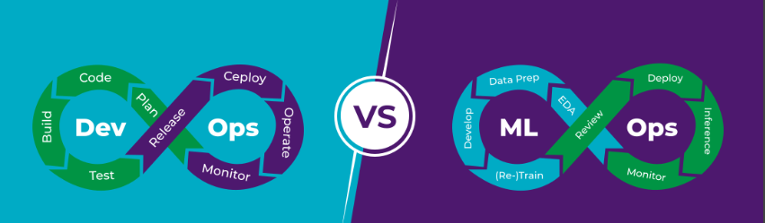
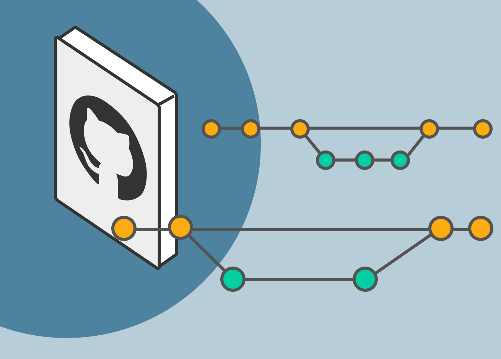
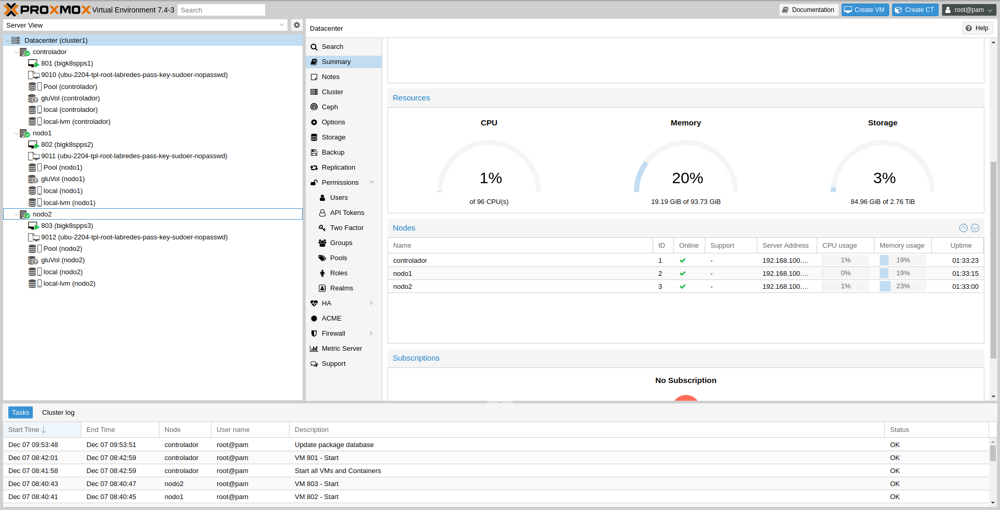
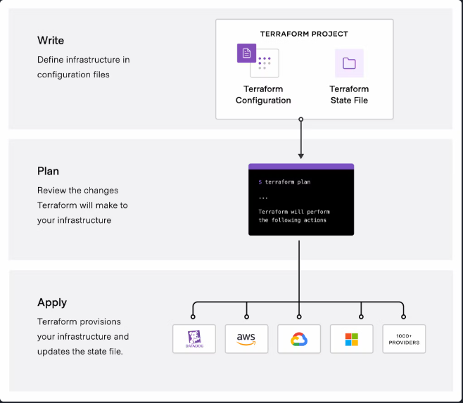
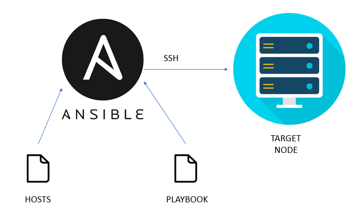
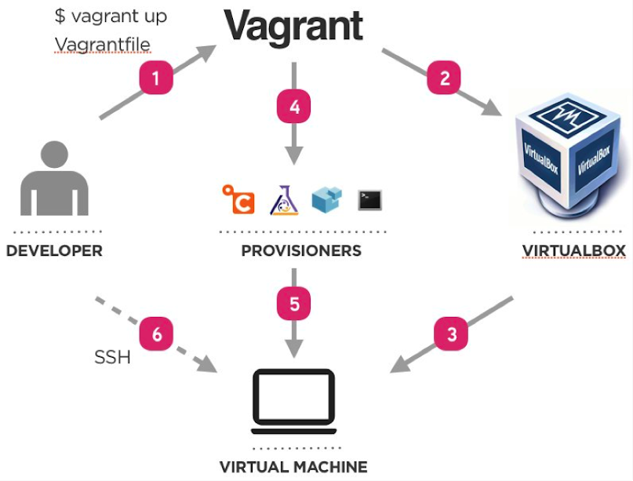
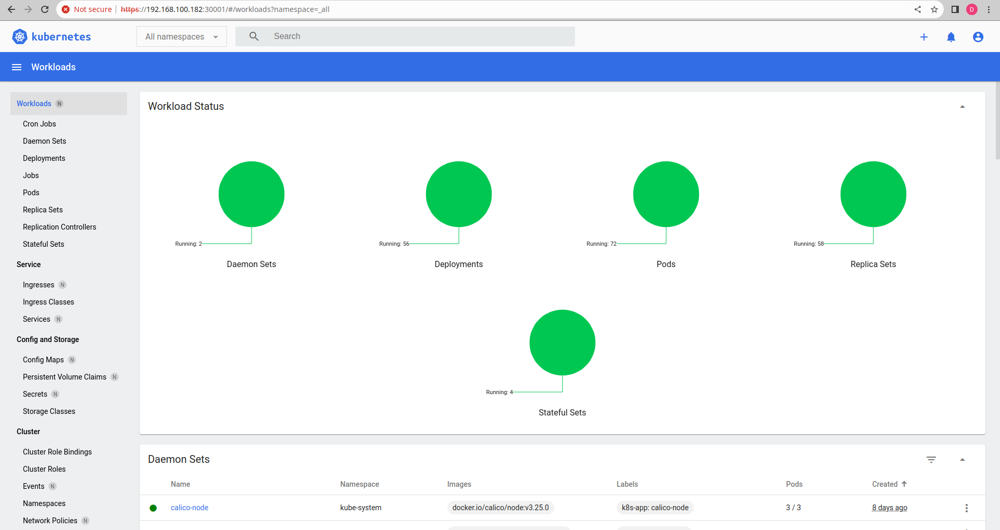
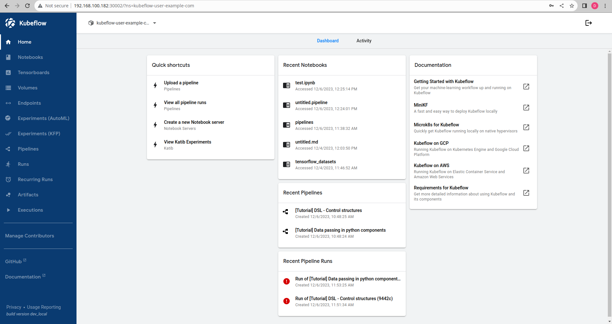
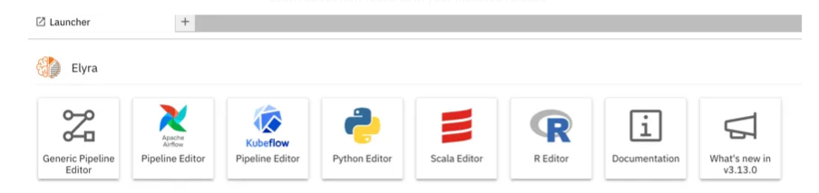

## Objetivos

### Objetivo General

Explorar, evaluar un conjunto de tecnologías esenciales que permiten la implementación exitosa de prácticas de Machine Learning Operations (MLOps) en el entorno universitario, haciendo hincapié en la reutilización, la reproducibilidad y la escalabilidad. La implementación de sistemas de MLOps se ha vuelto cada vez más crucial, ya que proporciona la infraestructura necesaria para respaldar a los científicos y expertos en la universidad en su búsqueda de soluciones basadas en Machine Learning. Facilita la gestión eficiente del ciclo de vida de los modelos, desde su desarrollo y entrenamiento hasta su despliegue y monitoreo, permitiendo así la reutilización de los recursos, la reproducibilidad de los resultados y la escalabilidad de las soluciones.

### Objetivos Específicos

- Investigar y evaluar tecnologías clave en el campo de MLOps, centrándose en la reutilización, reproducibilidad y escalabilidad.

- Seleccionar la herramienta más adecuada, entre las tecnologías disponibles open source, para implementar prácticas eficientes de MLOps en el entorno universitario.

- Diseñar e implementar la infraestructura basada en la herramienta seleccionada, que permita gestionar el ciclo de vida completo de los modelos de Machine Learning.

- Desarrollar pipelines de flujo de trabajo utilizando la herramienta seleccionada, para automatizar tareas como el entrenamiento, evaluación y despliegue de modelos.

- Integrar modelos de Machine Learning en los pipelines, asegurando la correcta reproducción de los resultados y la reutilización de componentes.

- Realizar pruebas exhaustivas y ajustes en los pipelines implementados, garantizando su funcionamiento correcto y eficiente.

- Redactar un informe final que documente el proceso de implementación, destacando la reutilización, reproducibilidad y escalabilidad logradas, así como los beneficios obtenidos para la universidad en el ámbito de MLOps.

## Descripción de la Empresa

El Grupo de Investigación en Ciencia de Datos (GCID) se sitúa en la vanguardia de la investigación y la innovación en el campo de la Ciencia de Datos. Este grupo se caracteriza por su enfoque interdisciplinario, que abarca métodos científicos, procesos y sistemas diseñados para extraer conocimiento de datos en diversas formas, desde datos estructurados hasta datos no estructurados. La Ciencia de Datos es una disciplina que unifica estadísticas, análisis de datos, aprendizaje automático y métodos relacionados para comprender y analizar fenómenos reales utilizando técnicas y teorías provenientes de diversas áreas del conocimiento.
El GCID se encuentra en el epicentro de la revolución tecnológica de la Industria 4.0, donde la acumulación exponencial de datos, la inteligencia artificial y la interconexión masiva de sistemas y dispositivos digitales están transformando radicalmente la forma en que las organizaciones operan y toman decisiones. El grupo se enfoca en aprovechar estas tendencias para brindar soluciones tanto a la Universidad Nacional de Río Cuarto como a entidades públicas y privadas a nivel nacional e internacional.
Para abordar los desafíos de la Ciencia de Datos, el GCID trabaja en estrecha colaboración con tecnologías habilitadoras como el Internet de las cosas (IoT), La Industria 4.0, los sistemas ciber físicos, la cultura maker entre otros. Estas tecnologías proporcionan el marco necesario para la recopilación, el procesamiento y el análisis de datos en tiempo real.
El grupo reconoce que extraer información valiosa de grandes volúmenes de datos es un desafío multidisciplinario que requiere una visión integral. Por lo tanto, los miembros del grupo provienen de diversos campos, incluyendo matemáticas, estadísticas, ciencia de la información y computación, lo que promueve la colaboración y el enfoque conjunto en la resolución de problemas. El GCID se esfuerza por convertirse en un referente en la Universidad Nacional de Río Cuarto y la región en temas relacionados con la Ciencia de Datos, a través de la docencia, la investigación, el desarrollo tecnológico y la transferencia de conocimiento al medio.

## Descripción de las tareas realizadas

### Contextualización: DEVOps y MLOps

En el contexto del proyecto, la implementación de prácticas DevOps y MLOps se traduce en la automatización eficiente de los procesos relacionados con la infraestructura, el desarrollo de software, el entrenamiento de modelos de aprendizaje automático y la implementación de soluciones. Estos enfoques garantizan una entrega continua, confiable y eficiente, permitiendo a los equipos de desarrollo y operaciones colaborar de manera efectiva y proporcionar soluciones que se ajusten a los requisitos del proyecto de manera ágil y escalable. La adopción de DevOps y MLOps contribuye a la eficiencia, la calidad y la innovación en el desarrollo y operación del proyecto.

Con lo mencionado, se entiende que las pŕacticas llevada a cabo en este proyecto están estrictamente relacionadas con estos conceptos, entendiendo que hay un equipo de desarrolladores (científicos) que se verán beneficiados por el despliegue e implementación de esta herramienta que seleccionamos.

#### Contexto de trabajo y estado del arte

El laboratorio se realiza sobre un cluster de 3 nodos físicos, los cuales proveen los recursos necesarios que serán utilizados por el hipervisor y herramienta de virtualización Proxmox para agrupar dichos recursos. Lo anterior permitió crear una infraestructura virtual basada en máquinas virtuales, separando nuestras pruebas del resto de los demás ambientes de desarrollo. Entre las tecnologías disponibles open soirce, para implementar las pŕacticas eficientes de MLOps propuestas: Kubeflow, Airflow, MLFlow y DVC, todas ellas pueden ser desplegadas sobre Kubernetes, comúnmente conocido como K8s, es una plataforma de código abierto diseñada para automatizar, implementar y gestionar aplicaciones en contenedores. Su función principal es orquestar contenedores, facilitando la administración eficiente y escalable de aplicaciones. Ampliamente utilizado en entornos de nube y locales, Kubernetes se basa en la tecnología de contenedores, proporcionando un entorno aislado y portátil para aplicaciones y sus dependencias. Todo lo nombrado anteriormente se condice con los objetivos planteados para esta práctica.

Por otro lado, para la realización de esta práctica se definió utilizar metodolofías ágiles basadas en Scrum utilizando la plataforma de GitHub. Esto nos permitió llevar un orden y seguimiento del desglose de tareas a la hora de resolver las actividades planteada.

### Comparación de herramientas

**Kubeflow** ofrece una forma escalable de entrenar y desplegar modelos en Kubernetes. Es un medio de orquestación que permite que un framework de aplicaciones en la nube funcione sin problemas. Algunos de los componentes de Kubeflow son los siguientes:

- **Notebooks:** Ofrece servicios para crear y gestionar cuadernos Jupyter interactivos en entornos corporativos. También incluye la posibilidad de que los usuarios construyan contenedores de Notebooks o pods directamente en clusters.

- **Entrenamiento de modelos de TensorFlow:** Kubeflow viene con un "job operator" (1) de TensorFlow personalizado que facilita la configuración y ejecución del entrenamiento de modelos en Kubernetes. Kubeflow también admite otros frameworks mediante job operators a medida, pero su madurez puede variar.

- **Pipelines:** Los pipelines de Kubeflow permiten construir y gestionar flujos de trabajo de aprendizaje automático de múltiples pasos que se ejecutan en contenedores Docker.

- **Despliegue:** Kubeflow ofrece varias formas de desplegar modelos en Kubernetes a través de complementos externos.

**MLflow** es un framework de código abierto para el seguimiento de todo el ciclo de aprendizaje automático de principio a fin, desde la formación hasta la implementación. Entre las funciones que ofrece se encuentran el seguimiento de modelos, la gestión, el empaquetado y las transiciones centralizadas de etapas del ciclo de vida. Algunos de los componentes de MLflow son los siguientes:

- **Seguimiento:** Mientras ejecutas tu código de aprendizaje automático, hay una API y una interfaz de usuario para registrar parámetros, versiones de código, métricas y archivos de salida para que puedas visualizarlos más tarde.

- **Proyecto:** Proporcionan un estilo estándar para empaquetar código de ciencia de datos reutilizable; no obstante, cada proyecto es un directorio de código o un repositorio Git que utiliza un archivo descriptor para indicar las dependencias y cómo ejecutar el código.

- **Modelos:** Los modelos MLflow son un estándar para la distribución de modelos de aprendizaje automático en una variedad de sabores. Hay varias herramientas disponibles para ayudar con el despliegue de varios modelos. Cada modelo se guarda como un directorio con archivos arbitrarios y un archivo de descripción del modelo ML que identifica los sabores en los que se puede utilizar.

- **Registro:** Le ofrece un almacén de modelos centralizado, una interfaz de usuario y un conjunto de API para gestionar de forma colaborativa el ciclo de vida completo de su modelo MLflow. Proporciona linaje de modelos, versiones de modelos, transiciones de etapas y anotaciones.

**Airflow** es una plataforma de gestión de flujos de trabajo de código abierto creada por Airbnb en 2014 para crear, supervisar y programar mediante programación los crecientes flujos de trabajo de la empresa. Algunos de los componentes de Airflow son los siguientes:

- **Scheduler:** Supervisa las tareas y los DAG, activa los flujos de trabajo programados y envía las tareas al ejecutor para que las ejecute. Está diseñado para ejecutarse como un servicio persistente en el entorno de producción de Airflow.

- **Ejecutores:** Son mecanismos que ejecutan instancias de tareas; prácticamente ejecutan todo en el planificador. Los ejecutores tienen una API común y puede intercambiarlos en función de los requisitos de su instalación. Sólo puede tener configurado un ejecutor por vez.

- **Servidor web:** Una interfaz de usuario que muestra el estado de sus trabajos y le permite ver, activar y depurar DAGs (2) y tareas. También le ayuda a interactuar con la base de datos y a leer registros del almacén de archivos remoto.

- **Base de datos de metadatos:** La base de datos de metadatos es utilizada por el ejecutor, el servidor web y el scheduler para almacenar el estado.

**Data Version Control(DVC)** es un sistema de control de versiones de código abierto utilizado en proyectos de aprendizaje automático. También se conoce como Git para ML. Se ocupa de las versiones de datos en lugar de las versiones de código. DVC le ayuda a lidiar con grandes modelos y archivos de datos que no pueden ser manejados usando Git. Le permite almacenar información sobre las diferentes versiones de sus datos para realizar un seguimiento adecuado de los datos de ML y acceder al rendimiento de su modelo más tarde. Puede definir un repositorio remoto para enviar sus datos y modelos, lo que facilita la colaboración entre los miembros del equipo.

Para obtener el resultado deseado, los usuarios no tienen que recordar manualmente qué modelo de datos utiliza qué conjunto de datos y qué acciones se llevaron a cabo; de todo esto se encarga DVC. Consiste en un conjunto de herramientas y procesos que rastrean las versiones cambiantes de los datos y las colecciones de datos anteriores. Los repositorios de DVC contienen los archivos que están bajo el efecto del sistema de control de versiones. Se mantiene un estado clasificado para cada cambio que se confirma en cualquier archivo de datos.

Luego de analizar las capacidades de cada uno de los sistemas vistos anteriormente, podemos decir que si nuestro sistema necesita tratar con múltiples tipos de flujo de trabajo, no sólo aprendizaje automático, Airflow puede ayudarnos mejor. Es un marco de orquestación de flujos de trabajo maduro, con soporte para muchos operadores, además del aprendizaje automático.

Si deseamos un sistema con patrones prediseñados para el aprendizaje automático y que funcione a gran escala en clústeres Kubenetes, podemos considerar Kubeflow. Muchos componentes específicos de ML en Kubeflow pueden ahorrarnos tiempo a comparación de si los hacemos con Airflow.

Si queremos desplegar MLOps en un sistema a pequeña escala (por ejemplo, una estación de trabajo, o un portátil), nos conviene elegir Airflow + MLflow, ya que elimina la necesidad de configurar y ejecutar un sistema Kubenetes, y ahorrar más recursos para las tareas principales.

Como DVC se dedica a una porción muy específica y similar a MLFlow, queda en la misma categoría que el párrafo anterior, no cumpliendo el ciclo completo y necesitando de la combinación con otro sistema.

En nuestro caso de aplicación, como nuestro cluster ya tiene Kubernetes y consideramos que es más completo y abarca todo el ciclo de trabajo completo, **la elección ideal sería Kubeflow**, por lo que ahondaremos más en el mismo para poder realizar su implementación.

>(1) *Job operator:* Es un recurso personalizado de Kubernetes que permite correr tareas de entrenamiento de TensorFlow en dicha plataforma.
>
>(2) *DAGs:* Directed Acyclic Graph, es una forma de modelar las redes neuronales en forma de nodos interconectados por flechas.

### Metodologías ágiles y GitHub

En la elección de la metodología ágil para la gestión de este proyecto, se optó por Scrum debido a su capacidad para fomentar la colaboración efectiva, la entrega iterativa y la adaptabilidad a los cambios en los requisitos del cliente. Scrum, alineado con los valores y principios del Manifiesto Ágil, proporciona un marco de trabajo estructurado con roles claramente definidos, destacando la importancia de la comunicación constante y la entrega continua de software valioso. La división de roles, con el tutor docente asumiendo el papel de Scrum Master y el tutor externo como Product Owner, permite una distribución clara de responsabilidades. Además, la elección de sprints semanales se alinea con la naturaleza del proyecto, facilitando una planificación detallada y una entrega regular de incrementos de valor.

***Ver anexo:** Metodologías Ágiles*

En cuanto al Git Workflow, se adoptó GitHub Workflow por su simplicidad y la familiaridad con la plataforma en la que se desarrolla el proyecto. GitHub Workflow ofrece un enfoque liviano y eficiente para el control de versiones, integrando la entrega continua con la capacidad de desplegar inmediatamente en la rama master. Este enfoque se ajusta adecuadamente a la naturaleza colaborativa del desarrollo, permitiendo la creación de ramas descriptivas para nuevas características, la apertura de Pull Requests para facilitar la revisión y la rápida integración en la rama principal una vez que se ha confirmado la funcionalidad.

***Ver anexo:** GitHub*

En conjunto, la combinación de Scrum como metodología ágil y GitHub Workflow como enfoque de control de versiones establece un marco sólido para la gestión y desarrollo efectivos de este proyecto, enfocándose en la entrega continua, la adaptabilidad y la colaboración eficiente entre los diferentes actores involucrados.

La adopción de esta combinación demostró ser sumamente beneficiosa en la fase de adquisición de conocimientos sobre las nuevas tecnologías a implementar. La orientación hacia las tareas específicas y los objetivos concretos proporciona una flexibilidad significativa en términos de gestión del tiempo y resolución desafíos de manera inmediata. Esto permitó la resolucón ágil de problermas y el aprendizaje efectivo. Además, la naturaleza ágil de este enfoque permitió ajustes rápidos de objetivos, permitiendo cambios dinámicos en la dirección del proyecto si un objetivo particular no alcanza un destino previsto o se evalúa como de escasa utilidad. En conjunto, estos elementos contribuyeron a una curva de aprendizaje inicial gradual que, una vez superada, aceleró notablemente la ejecución de tareas, resultando en una alta productividad.

Enlace al repositorio utilizado: [https://github.com/danunziata/pps-agustin_conti_2023](https://github.com/danunziata/pps-agustin_conti_2023)

### Diseño e implementación de la infraestructura basada en la herramienta seleccionada

Para implementar la plataforma Kubeflow, hemos definido requisitos específicos de infraestructura y software. Nuestra infraestructura se basa en un cluster compuesto por tres PC, donde utilizamos Proxmox para crear máquinas virtuales con recursos específicos y desplegar sobre ellas el software necesario.

#### Recursos físicos - Cluster del Laboratorio

Este conjunto consiste en tres PC con recursos significativos que suman un total de 96 CORES de CPU, 96 GB de Memoria RAM, y 3 TB de almacenamiento, aunque no cuentan con GPU por el momento.

#### Virtualización - Proxmox

Proxmox Virtual Environment, conocido como Proxmox, es una plataforma de virtualización de código abierto. Facilita la administración y despliegue de máquinas virtuales (VM) y contenedores en un entorno integrado. Proxmox utiliza KVM para VMs y LXC para contenedores, permitiendo ejecutar ambos en la misma plataforma. Su interfaz web, Proxmox Virtual Environment (PVE), simplifica la gestión de recursos físicos, creación de VMs, copias de seguridad, y más. Proxmox destaca por la gestión centralizada de recursos, diversas opciones de almacenamiento, administración de clústeres para alta disponibilidad, seguridad, y escalabilidad.

Seleccionamos Proxmox para nuestra plataforma debido a sus múltiples prestaciones y funcionalidades que se alinean con nuestros requisitos.

#### Aprovisionamiento de infraestructura y software

En sistemas y tecnología, el aprovisionamiento configura y suministra recursos, como servidores y redes, para satisfacer las necesidades de una aplicación. Este proceso, crucial para entornos de nube, se realiza mediante herramientas como Terraform. Terraform es una herramienta de infraestructura como código (IaC) que automatiza y estandariza la creación y configuración de recursos de infraestructura de manera consistente y repetible.

**Terraform**

Terraform, desarrollado por HashiCorp, es esencial para la creación y configuración de infraestructura como código. Utiliza declaraciones en archivos de configuración para definir recursos y dependencias, adoptando un enfoque declarativo y proporcionando una gestión eficiente. Terraform es compatible con diversos proveedores de infraestructura, permitiendo su uso en entornos locales o en la nube.

Para nuestro caso, necesitamos proveer máquinas virtuales sobre Proxmox, gracias a Terraform pudimos hacer una configuración previa considerando las necesidades de recursos, pudiendo definir la cantidad de núcleos, memoria RAM y almacenamiento, además de configurar algunas funcionalidades escenciales para la identificación (como el nombre de las máquinas e ID), la administración (claves SSH) y la conectividad (IPs), permitiendo así, tener una base para luego será usada para el aprovisionamiento de software.

***Ver anexo:** Terraform*

**Ansible**

Ansible, también de código abierto, se centra en la automatización y gestión de configuraciones de software. A diferencia de Terraform, trabaja en sistemas ya aprovisionados y se destaca por ser "sin agente". Utiliza Playbooks y Roles para describir tareas y configuraciones en sistemas remotos a través de SSH o WinRM.

Seleccionamos Ansible para configurar máquinas virtuales, crear un Cluster de Kubernetes y aprovisionar archivos necesarios para Kubeflow. Su enfoque en la eficiencia y consistencia en la instalación de software resultó crucial. Se estructuraron roles y playbooks para una máxima automatización y reproductibilidad.

Ansible fue de vital utilidad para configurar nuestras máquinas virtuales, crear un Cluster de Kubernetes funcional con dichas máquinas y aprovisionar con los diferentes archivos que serán necesarios para la instalación de nuestra plataforma, Kubeflow. En el proceso se definió la estructura de archivos requerida para el funcionamiento de esta herramienta, donde lo más importante a destacar son las "variables de grupo" que nos permitieron hacer un "plantillado" por usuario, de manera de asegurar la reproducibilidad de nuestro experimentos. Por otro lado se definieron "roles" que constan de archivos que contienen instructivos o tareas. Cada rol se puede asignar a "tareas generales" distintas, por lo que es fácil separar el trabajo en secciones más pequeñas que garanticen el entendimiento y por el otro lado, nos permitan aprovisionar "por sección" o "paso a paso" si es que lo deseamos gracias al uso del "tagging" (etiquetado) de dichos roles.

Los roles fueron seccionados en diferentes "etapas de configuración" donde se realizaron, entre otras tareas, la limpieza de viejos archivos de la máquina host, la instalación de multiples dependencias, la configuración del kernel de las máquinas remotas, la instalación de Kubernetes, la inicialización del cluster y la unión de los workers a dicho cluster y la descarga e instalación de los requerimientos de Kubeflow.

Estos roles y sus tareas fueron ordenados y asignados a los diferentes hosts gracias a a un "playbook" principal a partir del cual se seguia el orden de intalación, utilizando los hosts definidos en el "inventario".

Es de mucha importancia aclarar que durante todo el desarrollo del aprovisionamiento se buscó la máxima automatización a la hora de la creación tanto del entorno de pruebas, como del aprovisionamiento en sí.

***Ver anexo:** Ansible*

**Uso en conjunto - Terraform + Ansible**

La combinación de Terraform y Ansible es poderosa para gestionar integralmente infraestructura y software. Terraform se emplea para el aprovisionamiento inicial de recursos, mientras que Ansible configura y administra servidores y aplicaciones. Juntos, orquestan la implementación de aplicaciones, gestionan actualizaciones y cambios en la infraestructura, permiten la escalabilidad automática y garantizan la coherencia de la configuración continua. La integración de ambas herramientas abarca desde la creación de infraestructura hasta la administración completa del ciclo de vida del sistema, ofreciendo un enfoque completo y automatizado.

#### Orquestación de contenedores - Kubernetes

La investigación para nuestra plataforma Kubeflow involucró la comparación entre dos opciones, Kubernetes (K8s) y k0s. Optamos por Kubernetes debido a su exhaustiva funcionalidad y nuestra comprensión profunda de sus diversos componentes. Estos componentes incluyen nodos maestros y de trabajo, despliegues, pods, servicios, y configuración declarativa. Al implementar un Cluster de Kubernetes específico para Kubeflow, obtenemos escalabilidad según las necesidades de recursos, redundancia para mantener la continuidad del servicio y la capacidad de gestionar automáticamente la asignación de contenedores.

Además, se destacan tres elementos esenciales en la instalación de Kubernetes para Kubeflow: la Container Runtime Interface (CRI) con la elección de CRI-O por su ligereza, la Container Network Interface (CNI) para la configuración dinámica de recursos de red, y la StorageClass (SC) para proporcionar volúmenes de almacenamiento de manera dinámica y personalizada mediante Rancher. Estos elementos garantizan una implementación robusta y eficiente del entorno Kubernetes necesario para Kubeflow.

***Ver anexo:** Kubernetes*

#### Contexto de Testing Local vs Producción en el Cluster del Laboratorio

Para llevar a cabo prácticas y pruebas en un entorno local antes de la implementación en el cluster del laboratorio, se diseñó una estrategia específica. **Dado que no se contaba con acceso remoto al cluster**, se optó por construir una lógica de pruebas locales. En este contexto, se eligió Vagrant como la herramienta principal para emular la infraestructura del cluster. Vagrant facilitó la creación y gestión de máquinas virtuales en el entorno local del desarrollador, permitiendo probar de manera eficiente las configuraciones y roles de Ansible diseñados para el aprovisionamiento. Esta aproximación aseguró un proceso de desarrollo ordenado y reproducible.

Vagrant, en este escenario, ofreció un entorno aislado donde el desarrollador pudo desplegar y validar las herramientas necesarias, especialmente Ansible, para la instalación automática y configuración de los componentes esenciales, como Kubernetes (k8s) y Kubeflow. Esta práctica no solo simplificó la detección y corrección de posibles problemas, sino que también garantizó la consistencia y la reproducibilidad del entorno de prueba. La capacidad de Vagrant para crear y destruir fácilmente las máquinas virtuales facilitó la iteración en el desarrollo de roles de Ansible y en las primeras pruebas de despliegue de k8s y Kubeflow. Con esta estrategia, se estableció una base sólida antes de la implementación final en el cluster del laboratorio, asegurando que las configuraciones y herramientas estuvieran preparadas para su despliegue en un entorno de producción más complejo.

***Ver anexo:** Vagrant*

### Despliegue en Cluster: Puntos Claves de Ansible, Kubernetes (k8s) y Kubeflow con Información Adicional

Durante el proceso de despliegue en el cluster del laboratorio, se identificaron puntos clave en las herramientas utilizadas, especialmente en Ansible, Kubernetes (k8s) y Kubeflow.

En el caso de Ansible, la configuración y ejecución de roles resultaron esenciales. La estructuración adecuada de roles y playbooks permitió una instalación ordenada y modular de componentes en el cluster. La capacidad de Ansible para trabajar con hosts definidos en inventarios facilitó la asignación de tareas a nodos específicos, optimizando así el proceso de despliegue. Además, la incorporación de etiquetas (tags) en roles posibilitó una ejecución selectiva, permitiendo enfoques paso a paso y la repetición eficiente de tareas específicas. Un elemento crucial fue la implementación del "plantillado" o "creación de perfiles", que resultó vital para asegurar diferentes configuraciones personalizadas para cada usuario o prueba, permitiendo seleccionar la infraestructura deseada.

En el ámbito de Kubernetes (k8s), la comprensión de la arquitectura y la interacción de los componentes fue crucial. La definición de pods, servicios y despliegues, junto con la correcta configuración de nodos maestros y de trabajo, aseguró un despliegue estable y eficiente. La implementación de prácticas de seguridad, como la autenticación y autorización de usuarios, también se integró para fortalecer la infraestructura del cluster. Durante este proceso, la capacidad de levantar el servicio de Dashboard en Kubernetes fue de vital importancia, proporcionando una visualización más sencilla de las operaciones durante las pruebas y la instalación de Kubeflow. Asimismo, la atención meticulosa a las versiones de Kubelet, Kubectl, Kubeadm, CNI y CRI, junto con el aprendizaje y aplicación de comandos Kubectl, resultaron fundamentales para resolver problemas y optimizar el rendimiento del cluster.

En la sección de Kubeflow, la instalación representó un reto significativo debido a su estricta adherencia a versiones tanto en requisitos como en métodos de instalación. Se logró ejecutar exitosamente un ejemplo de entrenamiento de un modelo de clasificación MNIST, mientras se exploraba la funcionalidad del Dashboard de Kubeflow en la creación de Notebooks Servers. Este proceso implicó una investigación exhaustiva para encontrar las versiones compatibles y adaptarse a las rigurosas especificaciones de Kubeflow. Estos desafíos subrayan la necesidad de una cuidadosa planificación y consideración de versiones en proyectos similares.

***Ver anexo:** Instalación de Kubeflow*

### Pruebas realizadas

En el marco de las pruebas realizadas con Kubeflow, se llevó a cabo un ejemplo con TensorFlow para resaltar la eficacia de esta plataforma en entornos de ciencia de datos e inteligencia artificial.

Kubeflow demostró ser una herramienta valiosa al posibilitar la creación de perfiles y servidores de Notebooks, lo que permitió a los científicos realizar diversas pruebas de manera eficiente y organizada.

Durante estas pruebas, se exploraron los conceptos de "pipelines" en Kubeflow, que son flujos de trabajo automatizados que integran diversas tareas en un solo proceso.

Por otro lado, para las pruebas con los pipelines se investigó sobre Elyra, un editor de pipelines en JupyterLab, podría desempeñar un papel crucial al proporcionar una interfaz gráfica para ensamblar pipelines a partir de cuadernos Jupyter, scripts en Python o R, y código preempaquetado, todo ello sin necesidad de escribir código manualmente. Aunque no se pudo poner a prueba directamente en este escenario específico, se percibe como una herramienta que puede facilitar significativamente el trabajo de los científicos al proporcionar flexibilidad y eficiencia en el diseño, ejecución y personalización de pipelines.

Elyra también ofrece la capacidad de ejecutar estos pipelines en entornos remotos, donde Kubeflow Pipelines o Apache Airflow está desplegado. Al ejecutar un pipeline, Elyra genera los artefactos necesarios para el entorno de ejecución objetivo y desencadena su ejecución. Esto podría ser una característica valiosa para los científicos que buscan una manera colaborativa y reproducible de llevar a cabo sus investigaciones.

En resumen, Kubeflow, junto con la potencial integración de Elyra, se vislumbra como una combinación poderosa para diseñar, ejecutar y personalizar pipelines de manera eficiente en entornos de ciencia de datos. Esto proporcionaría a los científicos las herramientas necesarias para realizar investigaciones de manera efectiva y colaborativa.

***Ver anexo:** Correr Ejemplo*

### Tareas a futuro

En la continuación de este proyecto de prácticas, se vislumbran diversos caminos para mejorar aún más la eficiencia y la robustez de la implementación. Uno de los aspectos cruciales a abordar sería la selección de modelos a desplegar, permitiendo la construcción de pipelines más optimizados y especializados. Este enfoque facilitaría la adaptabilidad a diferentes escenarios y requerimientos, contribuyendo a una implementación más precisa y eficiente de modelos de aprendizaje automático.

La seguridad es otra área de vital importancia que merece una atención especial en los trabajos futuros. Fortalecer las medidas de seguridad en todos los niveles del sistema garantizaría la protección de datos sensibles y la integridad de los modelos, crucial en entornos donde la confidencialidad y la privacidad son prioridades. La implementación de protocolos de seguridad robustos sería esencial para mitigar posibles riesgos y asegurar un despliegue confiable de los flujos de trabajo de machine learning.

Asimismo, se plantea la necesidad de abordar la generación de los backups y la recuperación de datos en futuras etapas del proyecto. Establecer procedimientos sólidos para realizar copias de seguridad de modelos, datos y configuraciones críticas permitiría una rápida recuperación en caso de fallos inesperados o pérdida de información. Esta estrategia no solo contribuiría a la continuidad operativa sino que también respaldaría la integridad de los proyectos de machine learning a largo plazo.

Finalmente, la administración de perfiles se posiciona como un aspecto clave para mejorar la colaboración y la organización dentro del entorno de desarrollo. La capacidad de gestionar perfiles de manera eficiente, asignar roles y permisos de manera adecuada, facilitaría la colaboración entre científicos de datos y desarrolladores, promoviendo un flujo de trabajo armonioso y colaborativo. Integrar herramientas que simplifiquen esta administración sería esencial para optimizar la cooperación en el proyecto y mejorar la productividad del equipo.
