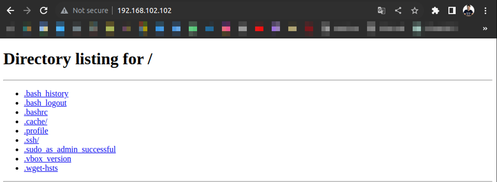
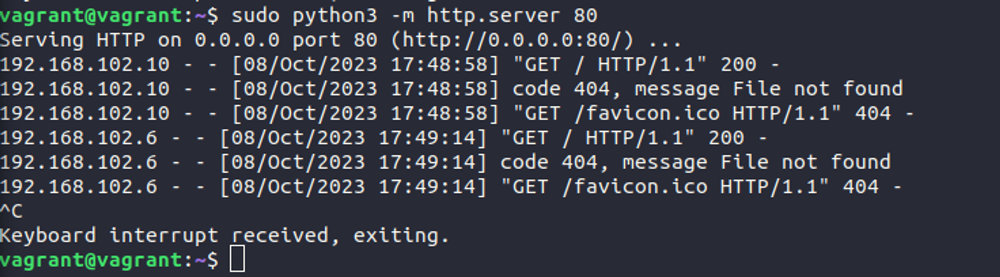
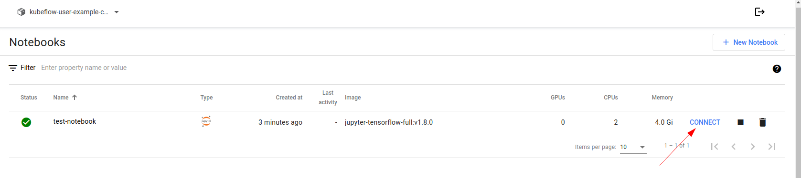
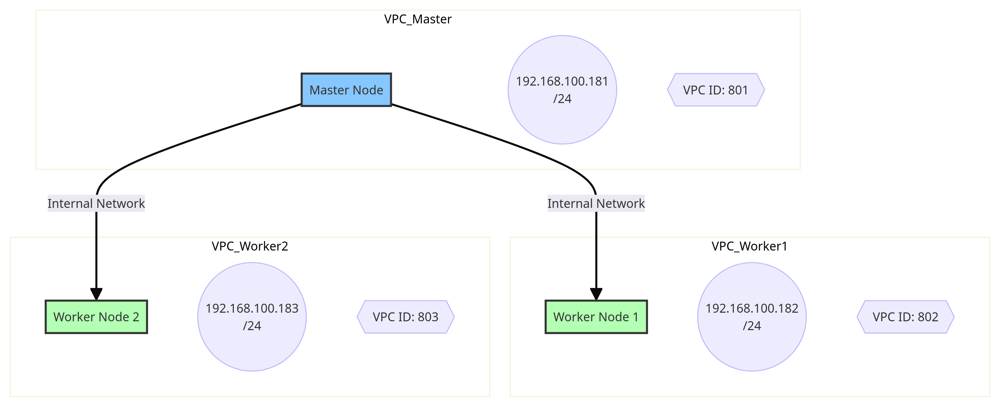

# Anexo

## Metodologías ágiles

### Manifiesto ágil

El Manifiesto Ágil es un documento que establece los valores y principios fundamentales para el desarrollo ágil de software. Fue creado en 2001 por un grupo de expertos en desarrollo de software que buscaban alternativas más flexibles y eficientes a los enfoques tradicionales de gestión de proyectos.

#### Valores del Manifiesto Ágil

1. **Individuos e interacciones sobre procesos y herramientas:** Se enfoca en la importancia de las personas y la comunicación efectiva en el desarrollo de software.
2. **Software funcionando sobre documentación extensiva:** Prioriza la entrega de software funcional y utilizable por encima de una documentación exhaustiva.
3. **Colaboración con el cliente sobre negociación contractual:** Destaca la importancia de la colaboración continua con el cliente para adaptarse a los cambios y requisitos emergentes.
4. **Responder a cambios sobre seguir un plan:** Aboga por la flexibilidad y la capacidad de adaptarse a cambios en los requisitos, incluso en etapas avanzadas del desarrollo.

#### Principios del Manifiesto Ágil

1. La más alta prioridad es satisfacer al cliente mediante la entrega temprana y continua de software valioso.
2. Aceptar cambios en los requisitos, incluso en etapas tardías del desarrollo.
3. Entregar software funcional con frecuencia, con preferencia a intervalos cortos.
4. Colaborar con clientes y usuarios a lo largo del proyecto.
5. Construir proyectos alrededor de individuos motivados, dándoles el entorno y el apoyo que necesitan y confiando en ellos para que hagan el trabajo.
6. El método más eficiente y efectivo de comunicación es la conversación cara a cara.
7. El software funcional es la principal medida de progreso.**
8. Mantenerte enfocado en la simplicidad, maximizando la cantidad de trabajo no realizado.
9. Las mejores arquitecturas, requisitos y diseños surgen de equipos autoorganizados.
10. A intervalos regulares, el equipo reflexiona sobre cómo ser más efectivo y ajusta su comportamiento en consecuencia.

Hoy en día, el Manifiesto Ágil sigue siendo un marco de referencia influyente para el desarrollo de software. Las metodologías ágiles como Scrum, Kanban y XP (eXtreme Programming) se basan en estos valores y principios. Las organizaciones adoptan enfoques ágiles para mejorar la flexibilidad, la capacidad de respuesta a cambios y la entrega continua de software de alta calidad. Además, la cultura ágil ha trascendido el ámbito del desarrollo de software y se ha extendido a otras áreas como la gestión de proyectos, el marketing y la gestión empresarial.

### Scrum: Roles y responsabilidades

Scrum es un marco de trabajo ágil que se utiliza comúnmente en el desarrollo de software para gestionar proyectos de manera iterativa e incremental. Los roles en Scrum son esenciales para la colaboración y la entrega efectiva de productos. Los roles principales en Scrum y sus responsabilidades son:

1. **Product Owner (Dueño del Producto):**
    - *Responsabilidades:*
        - Define la visión del producto.
        - Prioriza el backlog del producto.
        - Asegura que el equipo esté trabajando en las características más valiosas y prioritarias.
        - Toma decisiones sobre el alcance y las características del producto.
2. **Scrum Master (Facilitador del Proceso):**
    - *Responsabilidades:*
        - Garantiza que el equipo Scrum siga las prácticas y reglas de Scrum.
        - Facilita las reuniones del equipo, como las reuniones de planificación, revisión y retrospectiva.
        - Elimina los obstáculos que impiden el progreso del equipo.
        - Ayuda a mantener un entorno de trabajo colaborativo y centrado en la entrega de valor.
3. **Equipo de Desarrollo:**
    - *Responsabilidades:*
        - Desarrolla el producto durante los sprints.
        - Colabora en la planificación del sprint y define las tareas necesarias.
        - Se autoorganiza para lograr los objetivos del sprint.
        - Participa en las ceremonias de Scrum, como las reuniones diarias de scrum, la revisión y la retrospectiva.

Es importante destacar que en Scrum, se fomenta la colaboración y la autogestión del equipo. El Product Owner y el Scrum Master sirven al equipo y trabajan en conjunto para asegurar que el producto se desarrolle de manera efectiva y que se cumplan los objetivos del negocio. Además, Scrum promueve la transparencia, la inspección y la adaptación continua, lo que permite a los equipos responder rápidamente a los cambios en los requisitos o en el entorno del proyecto.

En Scrum, tanto el "Backlog" como el "Sprint" son conceptos fundamentales que contribuyen al enfoque iterativo e incremental del desarrollo de software.

1. **Backlog:**

    El "Product Backlog" (Backlog del Producto) es una lista dinámica y priorizada de todas las funcionalidades, mejoras y tareas que podrían ser realizadas para un producto. Es responsabilidad del Product Owner mantener y gestionar este backlog. Algunas características del Product Backlog incluyen:

    - **Priorización:** Las ítems del backlog están ordenados por prioridad, con las características más importantes o de mayor valor para el cliente en la parte superior.
    - **Flexibilidad:** El backlog es flexible y puede cambiar con el tiempo para adaptarse a las necesidades cambiantes del negocio o del cliente.
    - **Detalles:** Los elementos del backlog no necesitan estar detallados en exceso. Los detalles se refinan a medida que los elementos se acercan al tope del backlog y se preparan para ser incluidos en un sprint.
2. **Sprint:**

    Un "Sprint" es una unidad de tiempo fija y corta durante la cual se realiza un trabajo específico y se produce una versión potencialmente entregable del producto. Los sprints en Scrum generalmente tienen una duración de dos a cuatro semanas. Algunas características clave del Sprint incluyen:

    - **Objetivo del Sprint:** Antes de comenzar un Sprint, el equipo selecciona elementos del Product Backlog para incluir en el Sprint Backlog, que es la lista de elementos que se comprometen a completar durante el sprint.
    - **Iterativo e Incremental:** El trabajo se realiza en ciclos iterativos, y al final de cada Sprint, se produce un incremento potencialmente entregable del producto.
    - **Reuniones:** Durante el sprint, el equipo se reúne diariamente en la "Daily Scrum" para revisar el progreso y planificar el trabajo del día.
    - **Revisión y Retrospectiva:** Al final del Sprint, se llevan a cabo la "Sprint Review" para presentar el trabajo completado y obtener retroalimentación, y la "Sprint Retrospective" para analizar el proceso y mejorar en futuros sprints.

La combinación del Backlog y los Sprints permite a los equipos Scrum mantener un enfoque ágil y responder rápidamente a los cambios en los requisitos del cliente o del negocio, al tiempo que entrega de manera regular incrementos de valor al producto.

Para nuestro caso, el tutor docente actuaría como Scrum Master, el tutor externo actuaría de Product Owner y el equipo de desarrollo estaría conformado por el alumno. Además hemos definido los **sprints de una semana**, y tomaremos tareas del backlog que se ha conformado a partir del plan de trabajo de esta PPS.

### Cultura DevOps

La cultura DevOps es una filosofía y práctica que promueve la colaboración estrecha y continua entre los equipos de desarrollo (Dev) y operaciones (Ops) en el ciclo de vida del desarrollo de software. El objetivo principal es superar las barreras tradicionales entre estos dos departamentos para lograr una entrega de software más rápida, eficiente y confiable.

#### Principios y Valores de la Cultura DevOps

1. **Colaboración y Comunicación:**
    - *Principio:* Fomentar la colaboración abierta y una comunicación efectiva entre los equipos de desarrollo y operaciones.
2. **Automatización:**
    - *Principio:* Automatizar tanto como sea posible los procesos de desarrollo, prueba y despliegue para mejorar la eficiencia y reducir errores.
3. **Entrega Continua:**
    - *Principio:* Buscar la entrega continua de software, permitiendo versiones pequeñas y frecuentes en lugar de despliegues masivos y menos frecuentes.
4. **Monitoreo y Retroalimentación:**
    - *Principio:* Implementar sistemas de monitoreo para obtener retroalimentación rápida sobre el rendimiento y la calidad del software en producción.
5. **Responsabilidad Compartida:**
    - *Principio:* Fomentar una mentalidad de responsabilidad compartida entre los equipos de desarrollo y operaciones en todo el ciclo de vida del software.

#### Cómo se utiliza hoy en día

La cultura DevOps se implementa mediante la adopción de prácticas y herramientas específicas, como:

- **Despliegue Continuo (Continuous Deployment):** Automatización del proceso de liberación de software para que nuevas versiones puedan ser implementadas de manera rápida y segura.
- **Infraestructura como Código (Infrastructure as Code - IaC):** Definir y gestionar la infraestructura de manera automatizada, tratándola como código, lo que facilita la reproducibilidad y escalabilidad.
- **Integración Continua (Continuous Integration):** Integrar el código de los desarrolladores en un repositorio compartido varias veces al día, lo que facilita la detección temprana de errores.
- **Monitoreo Continuo y Análisis de Logs:** Utilizar herramientas para monitorear el rendimiento en tiempo real y analizar los registros para identificar problemas y áreas de mejora.

A modo de síntesis, la cultura DevOps busca mejorar la colaboración, eficiencia y velocidad en el desarrollo y despliegue de software, y se apoya en la automatización, la entrega continua y la responsabilidad compartida entre los equipos de desarrollo y operaciones.

### Objetivos SMART

Los objetivos SMART son una metodología utilizada para establecer metas y objetivos de manera clara y específica. El acrónimo SMART representa los criterios que deben cumplir estos objetivos:

1. **Específicos (Specific):** Los objetivos deben ser claros y específicos, evitando ambigüedades y definiciones vagas.
2. **Medibles (Measurable):** Deben incluir criterios cuantificables para evaluar el progreso y determinar cuándo se ha alcanzado el objetivo.
3. **Alcanzables (Achievable):** Los objetivos deben ser realistas y alcanzables dentro del contexto y recursos disponibles.
4. **Relevantes (Relevant):** Deben estar alineados con los objetivos generales y estratégicos de la organización.
5. **Temporizables (Time-bound):** Deben tener un plazo o período de tiempo específico para su cumplimiento.

Relacionando los objetivos SMART con Scrum en el contexto de Backlog, Sprint o Tarea:

- **Backlog:** Los elementos del Product Backlog en Scrum se benefician al ser definidos de manera SMART. Cada elemento debe ser específico en cuanto a su funcionalidad, medible en términos de valor para el usuario, alcanzable dentro del alcance del proyecto, relevante para los objetivos del producto y con un plazo temporal definido.
- **Sprint:** Los objetivos de cada Sprint, establecidos durante la planificación del Sprint, también pueden seguir la metodología SMART. Al ser específicos, medibles, alcanzables, relevantes y temporizables, estos objetivos guiarán el trabajo del equipo durante el Sprint.
- **Tarea:** Incluso a nivel de tareas individuales dentro de un Sprint, la aplicación de la metodología SMART puede ser útil. Cada tarea puede ser definida de manera específica, medible en términos de esfuerzo o resultados, alcanzable para un miembro del equipo, relevante para los objetivos del Sprint y con un plazo temporal asignado.

La aplicación de objetivos SMART en Scrum contribuye a una mayor claridad, enfoque y medición del progreso en el desarrollo de software, alineando los esfuerzos del equipo con metas claras y alcanzables.

### A modo de síntesis

Las metodologías ágiles, encabezadas por el Manifiesto Ágil, han transformado la forma en que se aborda el desarrollo de software al promover valores como la flexibilidad, la colaboración y la entrega continua de valor al cliente. SCRUM, una de las metodologías ágiles más populares, opera bajo los principios del Manifiesto Ágil y estructura el desarrollo en sprints, con roles claramente definidos y un enfoque en la transparencia y adaptabilidad. La cultura DevOps, por otro lado, se alinea con los principios ágiles al fomentar la colaboración estrecha entre los equipos de desarrollo y operaciones, buscando la automatización y la entrega continua. En este contexto, los objetivos SMART se integran como una metodología clave para establecer metas claras, medibles y alcanzables, proporcionando un marco estructurado que puede aplicarse tanto a la gestión del backlog en SCRUM como a los objetivos específicos de cada sprint. La combinación de metodologías ágiles, SCRUM, la cultura DevOps y objetivos SMART crea un entorno de desarrollo flexible, colaborativo y orientado a resultados, permitiendo a los equipos adaptarse rápidamente a los cambios, mejorar continuamente y cumplir con los objetivos estratégicos de la organización.

## GitHub

### Semantic Releases

#### ¿Qué es una ‘release’?

Una release es empaquetar cualquier cambio en el código y enviarlo a producción. Por ejemplo, un cambio de nuestra página web que vaya al público y no a nuestra etapa de desarrollo.

El manejo de estas releases puede ser un poco complicado, especialmente si no seguimos un cierto standard. Por eso es que usamos ‘semantic versioning’ con git tags para manejar de manera fácil nuestras releases.

#### ¿Qué es el ‘semantic versioning’?

El semantic versioning es sólo un esqueman numérico, es una práctica estándar de la industria del software que sirve para indicar el “grado de cambios” que se han hecho desde la release de producción anterior. Todos usan semantic versioning, desde Git, hasta Firefox y los SO como iOS.

#### ¿Qué estructura tiene la semantic versioning?

Tiene 3 partes:

```
MAJOR.MINOR.PATCH
```

Cada una de las partes indica algo diferente cuando incrementa:

- **Major:** Cuando vamos de 1.0.0 a 2.0.0 indicamos que cambiamos de manera disruptiva, incluimos cambios que no sean compatibles hacia atrás, etc. Por ejemplo, remover código que ya no sirve para incluir una reestructuración completa de la arquitectura de nuestra aplicación.

- **Minor:** Cuando vamos de 1.0.1 a 1.1.0 indicamos que cambiamos funcionalidades, pero que estos cambios son compatibles hacia atrás. Puede ser el cambio de una funcionalidad, la actualización de una, el agregado de otra.

- **Patch:**  Cuando vamos de 1.0.1 a 1.0.2 indicamos arreglos de bugs y actualizaciones triviales.

#### Premisas del semantic versioning

- Una vez hecha una release, la versión no puede ser cambiada
- Si nos olvidamos algo no podemos “retaggear” una versión, estos deberían entrar en una nueva release.
- Somos responsables de checkear reiteradamente la versión actual antes de hacer un release.

#### Git Tagging ¿Qué es un Tag?

Es una manera de agregar un marcador o marker a un commit para indicar que es importante de alguna manera en nuestro repositorio. Hay dos diferentes tipos de GitTags:

- **Lightweigh tags:** Un puntero con nombre básico para un commit.

    ```sh
    > git tag <tag-name> [commit]
    ```

- **Annotated tags:** Un objeto completo en la database de git verificado, contiene información de el tag, tiene un mensaje de taggeo (tagging message) y puede ser firmada y verificada con GNU Privacy Guard (GPG). Esta última es la que se recomienda usar.

    ```sh
    > git tag -a <tag-name> -m"<annotation>" [commit]
    ```

Tanto el semantic versioning como el GitTagging van de la mano, podemos agregar un commit taggeando la versión correspondiente.

#### Semantic versioning + Annotated Tags = Semantic Releases

Nos permite tener commits marcados en nuestro repositorio de git con una versión específica. Los beneficios de esto en un repositorio de git son:

- Le da significado a los cambios importantes en nuestro repositorio.
- Comunica el “grado de cambio” entre los diferentes tags.
- Vemos de manera directa el historial de tracking de los cambios realizados.

#### ¿Por qué plataformas o herramientas está soportado esto?

- Diferentes interfaces de Git, como Git Kraken o GitHub Desktop.
- Diferentes herramientas de automatización como Circle CI, Bitbucket, Travis, etc.

#### ¿Cómo creo las 'Semantic Git Releases'?

Es un proceso que consiste en 3 pasos:

1. Crear un annotated tag
    1. Usar semantic versioning para el nombre del tag
    2. Brindar una annotation
2. Pushear el tag al repositorio remoto
3. Insertar los pasos de deployment acá

Crear una un semantic release tag usando la consola:

```sh
> git tag -a v1.0.0 -m "release 1.0.0"
> git push <remote> v1.0.0
```

#### Release Notes

Tenemos que evitar las anotaciones mínimas. Se recomienda, para cada tipo de release:

- **Patch:** Lista de los bug fixes
- **Minor:** Lista de cambios, detalles de uso.
- **Major:** Lista de elementos removidos, lista de cosas agregadas, proceso de actualización.

**Tomar una lista de los mensajes de los commits entre releases:**

```sh
git log --pretty=format:%s <last release>... HEAD --no-merges

git tag -a <tag-name> -m"$(git log --pretty=format:%s <last release>... HEAD --no-merges)"
```

#### ¿Cómo automatizo la generación de los tags?

- Puedo buscar en el mercado por alguna herramienta de automatización.
- Crear un script de bash por nosotros mismos para ayudarnos a automatizar los pasos repetitivos.

### Git Workflow

Los Git Workflows son metodologías de trabajo para los usuarios de de Git.  

#### Git Flow

Es el workflow más conocido, basado en dos branches principales que son perpetuas, con vida infinita. Estas son:

- **master:** Tiene el código de producción. Todo el código de desarrollo es ‘mergeado’ dentro de la branch master en algún momento.
- **develop:**  Contiene el código de pre-producción. Cuando las modificacioens o nuevas características estén finalizadas, se ‘mergean’ en la branch develop.

Durante el ciclo de desarrollo, una variedad de ramas de soporte son utilizadas:

- **feature-*:** Usada para desarrollar nuevas caracterísitcas que vendrán en las futuras releases. Debería desprenderse de la rama develop y mergearse en la rama develop.
- ***hotfix-*:** Son necesarias para actuar inmediatamente ante un estado indeseado de la branch master. Debería desprenderse de la branch master y mergearse tanto en máster como en develop.
- **release-*:** Son la preparación de una nueva release de producción. Permiten que haya menos bugs que arreglar y la preparación de la metadata para la release. Debe desprenderse de la rama develop y debe ser mergeada en la rama master y develop.

#### GitHub Flow

Es un workflow liviano creado por GitHub y se basa en 6 principios:

1. Todo en la rama **master** es deployable.
2. Para trabajar en algo nuevo, creamos una rama desde la master con un nombre descriptivo.
3. Hacemos commit a esa rama localmente y regularmente hacemos push del trabajo a la misma rama en remoto.
4. Cuando necesitamos feedback o creemos que es necesario mergear, abrimos un Pull Request (PR).
5. Despues de que alguien haya revisado y firmado la nueva característica, se puede hacer merge en la master.
6. Una vez hecho el merge y pusheado a la rama master, debemos deployar inmediatamente.

#### GitLab Flow

Es un workflow creado por GitLab. Combina un desarrollo dirigido por las funcionalidades (caracteristicas) y con ramas de funcionalidades con un trackeo de problemas.

La mayor diferencia con GitHub Flow es el ambiente de las ramas que tenemos en GitLab Flow (staging y production) porque será un proyecto que no puede deployarse en producción cada vez que hacemos un merge de una nueva feature branch. Se basa en 11 principios:

1. Usa feature branches, no commits directos a master.
2. Prueba todos los commits, no solo los de la master.
3. Corre todos los test en todos los commits.
4. Hacer revisión de codigo antes de hacer el merge en master.
5. Los deployments son automáticos, basados en las branches o tags.
6. Los tags son configurados por el usuario, no por el CI.
7. Las releases son basadas en tags.
8. Los commits ya pusheados nunca son rebasados.
9. Todos comienzan por master y apuntan a master.
10. Corregir bugs en master primero, release branches segundo.
11. Los commits reflejan la intención.

#### ¿Cual elegimos?

Por simplicidad y por la plataforma en la que estamos trabajando el workflow más conveniente será **GitHub Workflow**.

## Vagrant

Vagrant es una herramienta que podés usar para crear y gestionar entornos de desarrollo virtualizados de manera fácil y reproducible. Su uso típico es facilitar la creación de máquinas virtuales con configuraciones específicas para el desarrollo de proyectos.

Para comenzar un proyecto de Vagrant en el directorio /vagrant, el usuario puede seguir estos pasos:

1. **Instalación de Vagrant:**
Antes que nada, necesitás instalar Vagrant en tu máquina. Esto se puede hacer descargando el instalador desde el sitio oficial y siguiendo las instrucciones.
2. **Creación de un archivo Vagrantfile:**
En el directorio donde querés iniciar el proyecto, creá un archivo llamado `Vagrantfile`. Este archivo contendrá la configuración de la máquina virtual, como el sistema operativo, la cantidad de memoria RAM, etc.
3. **Configuración del Vagrantfile:**
Dentro del Vagrantfile, especificá la configuración deseada. Por ejemplo, podés elegir un sistema operativo base, asignar recursos como CPU y RAM, y configurar la red.
4. **Inicialización de la máquina virtual:**
Ejecutá el comando `vagrant up` en el directorio donde se encuentra el Vagrantfile. Este comando creará y provisionará la máquina virtual según la configuración especificada.
5. **Acceso a la máquina virtual:**
Utilizá el comando `vagrant ssh` para acceder a la máquina virtual recién creada. Esto abrirá una conexión SSH a la máquina virtual.

Algunas ventajas clave de utilizar Vagrant para levantar múltiples entornos de desarrollo son:

- **Reproducibilidad:** Con Vagrant, se puede garantizar que todos los miembros del equipo tengan exactamente el mismo entorno de desarrollo, evitando problemas de compatibilidad.
- **Portabilidad:** Los entornos Vagrant son independientes de la máquina host, lo que significa que podés compartir el mismo entorno de desarrollo en diferentes sistemas operativos.
- **Aislamiento:** Cada proyecto puede tener su propio entorno virtualizado, evitando conflictos entre dependencias y facilitando la gestión de versiones de software.
- **Eficiencia en el uso de recursos:** Vagrant permite ejecutar varias máquinas virtuales de manera eficiente, lo que es útil para simular entornos complejos, como redes privadas virtuales (VPNs) o arquitecturas de microservicios.

### Ejemplo de una Vagrantfile

Crearemos un entorno de 3 máquinas, una master y 2 nodos a los cuales les aplicaremos configuraciones generales y particulares a cad auno. Importante aclarar que usaremos una imagen distinta a la vista antes, en este caso será `ubuntu/trusty64`.

**¡Importante!** Para poder configurar cierta red privada deberemos crear o modificar el archivo `/etc/vbox/networks.conf` añadiendo la red de la siguiente manera:

```ruby
sudo su
echo "* 0.0.0.0/0" > networks.conf
```

**Primero vamos a crear las claves públicas y privadas para las conexiones SSH:**

Creamos nuestra propia clave pública y privada con `ssh-keygen`, procuramos no poner passphrase para que no se la solicite a las VMs a la hora de iniciarlas.

```bash
# ~/.ssh/
> ssh-keygen -t rsa -b 4096
Generating public/private rsa key pair.
Enter file in which to save the key (/home/aagustin/.ssh/id_rsa): vagrant_key
Enter passphrase (empty for no passphrase): 
Enter same passphrase again: 
Your identification has been saved in vagrant_key
Your public key has been saved in vagrant_key.pub
The key fingerprint is:
SHA256:K4v2o7EKOLfjCMLk7zVD4v234234c06peueU aagustin@hp-agustin
The key's randomart image is:
+---[RSA 4096]----+
|                 |
|                 |
|                 |
|                 |
| . . . .S     .  |
|= . 3 o ..   o.. |
|*o.+.*.... +.++. |
|o=o.B4==  . *++  |
|..=*+*=++ .+o. E |
+----[SHA256]-----+
```

**Ahora si, escribimos el archivo Vagrantfile:**

```ruby
# -*- mode: ruby -*-
# vi: set ft=ruby :

# All Vagrant configuration is done below. The "2" in Vagrant.configure
# configures the configuration version (we support older styles for
# backwards compatibility). Please don't change it unless you know what
# you're doing.

Vagrant.configure("2") do |config|
    
  # Image configuration (for all vm's)
  config.vm.box = "bento/ubuntu-22.04"
  config.vm.box_version = "202309.08.0"
  
  # SSH (for all vm's)
  config.ssh.insert_key = false
  config.ssh.forward_agent = true  
  config.ssh.private_key_path = ["/home/aagustin/.vagrant.d/insecure_private_key","/home/aagustin/.ssh/vagrant_key"]     
  config.vm.provision "file", source: "/home/aagustin/.ssh/vagrant_key.pub", destination: "/home/vagrant/.ssh/authorized_keys"

  # Declaring master node and defining it like a primary machine
  config.vm.define "master", primary: true do |master|
    
    # Resources (provider)
    master.vm.provider "virtualbox" do |vb|
      vb.gui = false
      vb.name = "trusty64-master"
      vb.memory = "2048"
      vb.cpus = "2"
    end

    # Configure synced folder
    #config.vm.synced_folder "~/my-loc/vagrant/synced/folders/master/", "/home/vagrant/"

    # Network configuration
    master.vm.network "public_network",
      bridge:"wlo1",
      ip: "192.168.102.102",
      netmask: "255.255.255.0"
    
    master.vm.network "private_network",
      ip: "192.168.55.2",
      netmask: "255.255.255.0",
      auto_config: false
    
    master.vm.network "forwarded_port",
      guest: 80,
      host: 31002
      
    # SSH
    master.ssh.host = "127.0.0.2"
    master.vm.network "forwarded_port",
      guest: 22,
      host: 2222,
      host_ip:"0.0.0.0",
      id: "ssh",
      auto_correct: true
    
    # Provisioning message
    master.vm.provision "shell",
      inline: "echo Hello master"
  end

  # Declaring secondary nodes (iteratively)
  (1..2).each do |i|
    config.vm.define "node-#{i}" do |node|
      
      # Resources (provider)
      node.vm.provider "virtualbox" do |vb|
        vb.gui = false
        vb.name = "trusty64-node-#{i}"
        vb.memory = "2048"
        vb.cpus = "2"
      end

      # Configure synced folder
      #config.vm.synced_folder "~/my-loc/vagrant/synced/folders/node-#{i}/", "/home/vagrant/"

      # Network configuration
      node.vm.network "public_network",
        bridge:"wlo1",
        ip: "192.168.102.10#{2+i}",
        netmask: "255.255.255.0"
      
      node.vm.network "private_network",
        ip: "192.168.55.#{2+i}",
        netmask: "255.255.255.0",
        auto_config: false
      
      node.vm.network "forwarded_port",
        guest: 80,
        host: 31002+i

      # SSH
      node.ssh.host = "127.0.0.#{2+i}"
      node.vm.network "forwarded_port",
        guest: 22,
        host: 2222+i,
        host_ip:"0.0.0.0",
        id: "ssh",
        auto_correct: true
           
      # Provisioning message
      node.vm.provision "shell", inline: "echo Hello node-#{i}"
    end      
  
  end

end
```

Notar que en la línea `config.ssh.private_key_path = ["/home/aagustin/.vagrant.d/insecure_private_key","/home/aagustin/.ssh/vagrant_key"]` ponemos dos opciones, lo que logramos con esto es que use primero la por default y luego de lograda la conexión ya configura la clave pública, entonces podemos acceder con la clave propia la próxima vez. Además es importante que esté desactivada la generación por defecto de nuevas claves así se usa la genérica, por eso tenemo la línea `config.ssh.insert_key = false`.

**Levantamos nuestra configuración:**

Podemos hacer `vagrant up` y por ultimo veremos el estado de estas con:

```sh
$ vagrant status
Current machine states:

master                    running (virtualbox)
node-1                    running (virtualbox)
node-2                    running (virtualbox)

This environment represents multiple VMs. The VMs are all listed
above with their current state. For more information about a specific
VM, run `vagrant status NAME`.
```

**Nos conectamos con las VPCs:**

Podemos acceder con SSH mediante:

```sh
ssh -p [puerto-vpc] vagrant@[ip-vpc] -i [ubicacion-priv-key]
```

Una vez hecha la conexión SSH, podemos ver la configuración de la red que le hemos establecido a dicha máquina virtual:

```sh
vagrant@vagrant:~$ ip -brief -c a
lo               UNKNOWN        127.0.0.1/8 ::1/128 
eth0             UP             10.0.2.15/24 metric 100 fe80::a00:27ff:fe3b:cf90/64 
eth1             UP             192.168.102.102/24 fe80::a00:27ff:fe3b:4c8d/64 
eth2             UP             192.168.55.2/24 fe80::a00:27ff:fef5:3997/64
```

**Levantamos un servicio de prueba:**

Podemos checkear el correcto funcionamiento de la IP pública y el port forwarding levantando un servicio con python en el puerto 80 de nuestra vPc:

```sh
sudo python3 -m http.server 80
```

Y luego, podemos acceder desde el navegador de la máquina host o cualquier navegador de cualquier dispositivo que esté conectado a la misma red local:





# Ansible

## Aprovisionar con Ansible - Instalación y conexión del host con el servidor

1. Instalamos Ansible en Ubuntu de la máquina host:

```sh
sudo apt update
sudo apt install software-properties-common
sudo apt-add-repository ppa:ansible/ansible
sudo apt update
sudo apt install ansible
```

1. Nos dirigimos a la carpeta de Ansible en nuestra máquina host:

```sh
cd /etc/ansible
```

2. Veremos listados los siguientes archivos y directorios:

```sh
ansible.cfg  hosts        roles/
```

Nos nos haremos una copia de hosts en formato .yaml en nuestra carpeta de trabajo:

```sh
sudo cp ./hosts ~/workdir/hosts.yaml
```

El archivo `hosts.yaml` es el **inventario** donde tendremos listados todos nuestros equipos que queremos controlar.

3. Configuramos el inventario `hosts.yaml` para el ejemplo, agregando las siguientes lineas:

```yaml
# Example for PPS
mycluster:
  hosts:
    master:
      ansible_host: 127.0.0.2
      ansible_port: 2222
      ansible_ssh_user: vagrant
      ansible_ssh_private_key_file: /home/aagustin/.ssh/vagrant_key
    nodo1:
      ansible_host: 127.0.0.3
      ansible_port: 2223
      ansible_ssh_user: vagrant
      ansible_ssh_private_key_file: /home/aagustin/.ssh/vagrant_key
    nodo2:
      ansible_host: 127.0.0.4
      ansible_port: 2224
      ansible_ssh_user: vagrant
      ansible_ssh_private_key_file: /home/aagustin/.ssh/vagrant_key

```

Lo anterior es equivalente a crear un **grupo** de equipos (en nuestro caso es uno solo) llamado "mycluster" y dentro de ese grupo definimos los hosts llamados **master, nodo1 y nodo2**. Además agregamos un usuario de ssh y una ruta para la llave privada, comentados, que nos servirán luego:

```sh
ansible -i hosts.yaml  all --list-hosts
```

Donde el `-i` nos sirve para indicar que queremos usar un archivo en particular de inventario, que en nuestro caso es `hosts.yaml` (importante que estemos posicionados en el directorio de ansible `/etc/ansible` o que indiquemos la ruta completa del archivo de inventario). Este comando nos devolverá el siguiente mensaje:

```sh
$ ansible -i hosts.yaml all --list-hosts
  hosts (3):
    master
    nodo1
    nodo2
```

Ahora deberemos configurar SSH para que Ansible pueda conectarse a los nodos que manejamos, en nuestro caso, a nuestra máquina virtual. Para configurar SSH y permitir conexiones SSH a sistemas remotos, debemos seguir estos pasos para agregar nuestra clave pública SSH al archivo `authorized_keys` en cada sistema remoto. En nuestro caso, ya lo hemos hecho con Vagrant:

- **Generar un par de claves SSH (si aún no lo hemos hecho)**:
Si no tenemos un par de claves SSH (una pública y una privada), ppodemos generarlas usando el comando `ssh-keygen` en la terminal del host. Si deseamos utilizar la configuración predeterminada y sin contraseña, simplemente presionamos Enter cuando se nos solicite una contraseña. Aquí tienes un ejemplo:

```sh
$ ssh-keygen

Generating public/private rsa key pair.
Enter file in which to save the key (/home/aagustin/.ssh/id_rsa): id_rsa_ansible
Enter passphrase (empty for no passphrase): 
Enter same passphrase again: 
Your identification has been saved in id_rsa_ansible
Your public key has been saved in id_rsa_ansible.pub
...
```

Esto generará un par de claves SSH en tu directorio de inicio (por defecto) en los archivos `id_rsa_asible` (clave privada) y `id_rsa_ansible.pub` (clave pública).

- **Copiar nuestra clave pública al sistema remoto**:
Ahora, debes copiar nuestra clave pública (`id_rsa.pub` por defecto) al sistema remoto. Podemos hacerlo manualmente o utilizando el comando `ssh-copy-id`. Por ejemplo usando `ssh-copy-id`:

```sh
ssh-copy-id usuario@nombre_del_sistema_remoto
```

Esto copiará nuestra clave pública al sistema remoto y la agregará al archivo `~/.ssh/authorized_keys` en ese sistema. Debemos asegurarnos de reemplazar `usuario` con nuestro nombre de usuario y `nombre_del_sistema_remoto` con la dirección IP o el nombre de host del sistema remoto.

```sh
$ ssh-copy-id vagrant@127.0.0.2
The authenticity of host '127.0.0.2 (127.0.0.2)' can't be established.
ED25519 key fingerprint is SHA256:xxxxxxxxxxxxxxxxxxxxx.
This key is not known by any other names
Are you sure you want to continue connecting (yes/no/[fingerprint])? yes
/usr/bin/ssh-copy-id: INFO: attempting to log in with the new key(s), to filter out any that are already installed
/usr/bin/ssh-copy-id: INFO: 1 key(s) remain to be installed -- if you are prompted now it is to install the new keys

Number of key(s) added: 1

Now try logging into the machine, with:   "ssh 'vagrant@127.0.0.2'"
and check to make sure that only the key(s) you wanted were added.
```

- **Iniciar sesión en el sistema remoto con SSH**:
Ahora, podemos iniciar sesión en el sistema remoto usando SSH y se utilizará nuestra clave pública para autenticarnos:

```sh
ssh usuario@nombre_del_sistema_remoto
```

Si hemos configurado todo correctamente, no debería ser solicitado para ingresar una contraseña. En su lugar, se utilizará tu clave privada local para la autenticación.

```sh
 Welcome to Ubuntu 22.04.3 LTS (GNU/Linux 5.15.0-83-generic x86_64)

 * Documentation:  https://help.ubuntu.com
 * Management:     https://landscape.canonical.com
 * Support:        https://ubuntu.com/advantage

  System information as of Mon Oct  9 02:46:20 PM UTC 2023

  System load:  0.0                Processes:             140
  Usage of /:   12.4% of 30.34GB   Users logged in:       0
  Memory usage: 11%                IPv4 address for eth0: 10.0.2.15
  Swap usage:   0%                 IPv4 address for eth1: 192.168.5.240


This system is built by the Bento project by Chef Software
More information can be found at https://github.com/chef/bento
Last login: Mon Oct  9 14:32:17 2023 from 10.0.2.2

```

- **Repetir el proceso para otros sistemas remotos**:
Debes repetir estos pasos para cada sistema remoto al que deseemos acceder con SSH. Copia tu clave pública al archivo `authorized_keys` en cada uno de esos sistemas.

Ahora podemos corroborar la conexión con los mismos con un modulo de ansible llamado `ping`, para ello necesitamos unos pasos previos así evitamos el error con el mensaje "Permission denied (publickey,password)" que sugiere que Ansible intentó usar autenticación mediante clave pública SSH, pero no pudo autenticarse con éxito.

**Comando PING**:

Es momento entonces de aplicar el comando de `ping` de la siguiente manera:

```sh
ansible -i hosts.yaml all -m ping
```

Donde el `-m` indica que vamos a usar un módulo de Ansible.

Si todo está correcto deberá devolvernos un ping exitoso a cada una de las IP's que configuramos previamente como el siguiente:

```sh
> ansible -i hosts.yaml all -m ping
nodo1 | SUCCESS => {
    "ansible_facts": {
        "discovered_interpreter_python": "/usr/bin/python3"
    },
    "changed": false,
    "ping": "pong"
}
nodo2 | SUCCESS => {
    "ansible_facts": {
        "discovered_interpreter_python": "/usr/bin/python3"
    },
    "changed": false,
    "ping": "pong"
}
master | SUCCESS => {
    "ansible_facts": {
        "discovered_interpreter_python": "/usr/bin/python3"
    },
    "changed": false,
    "ping": "pong"
}
```

Podremos empezar a ejecutar comandos con Ansible, por ejemplo, para ver qué tipo de SO y qué versión tenemos instalada nos vamos a valer del siguiente comando:

```sh
ansible -i hosts.yaml nodo1 -a "cat /etc/os-release"
```

Donde el `-a` indica que vamos a pasar argumentos al módulo.

Básicamente lo que hacemos es enviar ese comando al nodo1, lo que nos devolverá la lectura del archivo os-release, el cual contiene la versión del sistema.

```sh
nodo1 | CHANGED | rc=0 >>
PRETTY_NAME="Ubuntu 22.04.3 LTS"
NAME="Ubuntu"
VERSION_ID="22.04"
VERSION="22.04.3 LTS (Jammy Jellyfish)"
VERSION_CODENAME=jammy
ID=ubuntu
ID_LIKE=debian
HOME_URL="https://www.ubuntu.com/"
SUPPORT_URL="https://help.ubuntu.com/"
BUG_REPORT_URL="https://bugs.launchpad.net/ubuntu/"
PRIVACY_POLICY_URL="https://www.ubuntu.com/legal/terms-and-policies/privacy-policy"
UBUNTU_CODENAME=jammy
```

### Aprovisionar con Ansible - Creación de un playbook

Ahora veremos lo que es un **playbook**, con el cual, haremos lo mismo que hacemos con la consola de comandos pero expresado en un archivo de instrucciones. Podremos simplificar la estructura de la siguiente manera:

> PLAYBOOK > PLAYS > TASKS

El playbook es un archivo en formato `.yml` o `.yaml` . El cual, en principio crearemos en la carpeta de de trabajo `~/workdir/ansible/` para hacer más corta la ruta a la hora de escribir en consola, pero podría estar en cualquier lado y la usaríamos llamando a la ruta completa.

```sh
> ls
hosts.yaml  playbook.yaml
```

 **Permisos de usuario root en caso de ser necesario (no es el nuestro):**

Antes de poder ejecutar cualquier tarea nos debemos asegurar de tener los **permisos correspondientes**, para ello  vamos a configurar sudo sin contraseña para el usuario Ansible para permitir que el usuario Ansible (el usuario con el que nos conectaamos) ejecute comandos sin requerir una contraseña. Esto se hace editando el archivo de configuración sudo `(/etc/sudoers)` en el host remoto y agregando una entrada que permita comandos específicos sin contraseña.

Agregar una entrada en `/etc/sudoers` para permitir que el usuario Ansible ejecute comandos como root sin contraseña:

- Accedemos por SSH a la máquina de destino:

```sh
ssh vagrant@127.0.0.2
```

- Abrimos el archivo sudoers para edición utilizando un editor de texto en el host remoto (como visudo que garantiza que no se cometan errores de sintaxis) para abrir el archivo sudoers con privilegios de superusuario:

```sh
sudo visudo
```

- Agregamos la entrada para el usuario de Ansible en el archivo sudoers para permitir al usuario de Ansible ejecutar comandos sin requerir una contraseña. La entrada debe tener el siguiente formato:

```sh
# Ansible root privileges
vagrant ALL=(ALL:ALL) NOPASSWD: ALL
```

- Guardamos y cerramos.

Esto permite que el usuario Ansible ejecute cualquier comando como root sin requerir una contraseña. Deberemos tener en cuenta que esta opción **tiene implicaciones de seguridad** y debe usarse con precaución.

**Playbook**

Continuando con el playbook, la estructura de este archivo para el ejemplo de la instalación de la biblioteca `nano` deberá ser la siguiente:

```yaml
---
- name: I want to install vim # Name of the play
hosts: mycluster #  Name of the machine or a group of machines
become: yes # Adding root privileges
become_method: sudo # Uses sudo to get all privileges
become_user: vagrant # Once you use sudo, you become root user
tasks:
- name: Install vagrant # Name of the task
apt: # Name of the module
name: vim # Library to install
state: latest # ersion of that library
```

Para ejecutar ese archivo de instrucciones (`playbook.yml`), usamos el siguiente comando de Ansible:

```sh
ansible-playbook -i hosts.yaml playbook.yaml
```

Lo cual nos devolverá lo siguiente:

```sh
> ansible-playbook -i hosts.yaml playbook.yaml

PLAY [I want to install vim] ****************************************************************************

TASK [Gathering Facts] **********************************************************************************
ok: [master]
ok: [nodo2]
ok: [nodo1]

TASK [Install vim] **************************************************************************************
ok: [master]
ok: [nodo2]
ok: [nodo1]

PLAY RECAP **********************************************************************************************
master                     : ok=2    changed=0    unreachable=0    failed=0    skipped=0    rescued=0    ignored=0   
nodo1                      : ok=2    changed=0    unreachable=0    failed=0    skipped=0    rescued=0    ignored=0   
nodo2                      : ok=2    changed=0    unreachable=0    failed=0    skipped=0    rescued=0    ignored=0   
```

Veremos que en nuestro caso, no hubo instalación de nano porque ya existia entonces, se realizaron con éxito las tareas pero **no hubo cambio alguno.**

Importante que a la hora de ejecutar dichos comandos, Ansible **no hará cambios** si el estado deseado ya se ha logrado previamente. Por ejemplo, en este caso que queremos instalar nano suponiendo de que no estaba instalado, cuando lo ejecutemos por primera vez detectaremos que hay cambios, pero si lo ejecutamos por segunda vez veremos que habrá cero cambios ya que el estado deseado de tener instalado nano ya se ha cumplido.

Si el **estado deseado de la tarea fuera "absent"** en lugar de "latest", cuando lo corramos de nuevo, buscará que dicha librería *no esté*, nuevamente habrá un cambio y será la eliminación de dicha librería.

# Kubernetes

## Comparación de diferentes tecnologías

Deberemos explorar diferentes alternativas a la hora de ver qué nos conviene implementar, para ello se presentan las siguientes:

**Kubernetes (k8s):** Kubernetes es la orquestación de contenedores más robusta y ampliamente adoptada. Es ideal para despliegues a gran escala, gestionando clústeres de contenedores con una arquitectura maestra-nodo. Ofrece una amplia gama de características y es altamente personalizable, pero su complejidad puede ser abrumadora para proyectos más pequeños.

**K3s:** K3s es una versión liviana de Kubernetes diseñada para entornos con recursos limitados, como entornos de desarrollo local o dispositivos IoT. K3s simplifica la implementación y gestión de Kubernetes al reducir el número de componentes y requisitos del sistema. Esto lo hace más accesible para desarrolladores individuales y equipos que buscan una solución más ágil.

**K0s:** K0s es otra alternativa ligera a Kubernetes, pero se destaca por ser un clúster autocontenido y sin dependencias externas. Esto simplifica aún más la implementación y permite ejecutar clústeres de Kubernetes sin conexión a Internet. K0s es adecuado para escenarios donde la conectividad externa puede ser limitada o poco confiable.

**Minikube:** Minikube es una herramienta que facilita la ejecución de un clúster de Kubernetes de un solo nodo en entornos locales, como máquinas de desarrollo. Aunque es menos adecuado para producciones a gran escala, es una opción práctica para probar y desarrollar aplicaciones en un entorno controlado. Minikube permite a los desarrolladores experimentar con Kubernetes sin la necesidad de configuraciones complejas.

Por el momento centraremos nuestra atención en **k8s y k0s**, que a modo general podremos comparar rendimientos entre uno más completo y uno más simple, además podremos comparar la facilidad de instalación de los mismos.

## k0s: Versión alternativa y ligera de K8s

**K0s (pronunciado "k-zeros")** es una plataforma Kubernetes ligera y autosuficiente diseñada para ser fácilmente desplegada en diferentes entornos, incluso aquellos con restricciones de conectividad. A diferencia de las implementaciones de Kubernetes convencionales, k0s es un clúster autónomo y no requiere de componentes externos para su funcionamiento. A continuación, se detallan sus componentes y funcionalidades clave:

1. **API Server (Servidor de API):** El API Server de k0s es responsable de gestionar las operaciones y comunicación en el clúster. Proporciona una interfaz para interactuar con los recursos de Kubernetes.

2. **Controller Manager (Administrador de Controladores):** Este componente controla los controladores del sistema, que son procesos que regulan el estado del clúster y realizan acciones en respuesta a los cambios.

3. **Scheduler (Programador):** El Scheduler se encarga de distribuir los pods en los nodos disponibles en función de las capacidades y restricciones de estos.

4. **etcd:** K0s utiliza una versión embebida de etcd como almacenamiento de datos distribuido para mantener la coherencia del estado del clúster.

5. **Kubelet y Kube-proxy:** Estos componentes son esenciales en cualquier implementación de Kubernetes. Kubelet es responsable de ejecutar contenedores en los nodos, mientras que Kube-proxy facilita la comunicación de red entre los diferentes servicios.

6. **CoreDNS:** Proporciona servicios de resolución de nombres en el clúster, permitiendo la comunicación entre los servicios por nombre en lugar de direcciones IP.

7. **Kubelet y Kube-proxy:** Estos componentes son esenciales en cualquier implementación de Kubernetes. Kubelet es responsable de ejecutar contenedores en los nodos, mientras que Kube-proxy facilita la comunicación de red entre los diferentes servicios.

K0s es especialmente adecuado para entornos donde la conectividad a Internet es limitada o inestable, ya que puede operar de manera completamente autónoma. Su diseño ligero y su capacidad para funcionar como un clúster autónomo lo hacen apropiado para despliegues en dispositivos de borde (edge computing), entornos de desarrollo local y escenarios donde la simplicidad y la independencia de infraestructura externa son prioritarias. La facilidad de implementación y la capacidad de operar en entornos variados hacen que k0s sea una opción atractiva para casos de uso diversos.

**Aprovisionamiento de k0s con Ansible sobre VMs de Vagrant**

Creamos la carpeta k0s, donde aplicaremos primero el siguiente comando:

```sh
vagrant init
```

Dentro de la misma carpeta deberemos tener la siguiente estructura de archivos:

```txt
k0s/
|_ Vagrantfle
|_ ansible/
    |_ playbook.yaml
    |_ inventory/
    |    |_ inventory.yaml
    |_ roles/
        |_ .../
        |_ .../
            |_ .../

```

Ahora veremos que poner dentro de cada archivo.

En la `Vagrantfile` deberemos tener lo siguiente:

```ruby
# -*- mode: ruby -*-
# vi: set ft=ruby :

# All Vagrant configuration is done below. The "2" in Vagrant.configure
# configures the configuration version (we support older styles for
# backwards compatibility). Please don't change it unless you know what
# you're doing.

Vagrant.configure("2") do |config|
    
  # Image configuration (for all vm's)
  config.vm.box = "bento/ubuntu-22.04"
  config.vm.box_version = "202309.08.0"
  
  # SSH (for all vm's)
  config.ssh.insert_key = false
  config.ssh.forward_agent = true  
  config.ssh.private_key_path = ["/home/aagustin/.vagrant.d/insecure_private_key","/home/aagustin/.ssh/vagrant_key"]     
  config.vm.provision "file", source: "/home/aagustin/.ssh/vagrant_key.pub", destination: "/home/vagrant/.ssh/authorized_keys"

  # How many VMs to create
  VMS = 3

  # We need at least:
  # -initial_controller = must contain a single node that creates the worker and server tokens needed by the other nodes.
  # -controller = can contain nodes that, together with the host from initial_controller form a highly available isolated control plane.
  # -worker = must contain at least one node so that we can deploy Kubernetes objects.
  

  # Declaring nodes (iteratively)
  (1..VMS).each do |i|
    config.vm.define "k0s-#{i}" do |node|
      
      # Resources (provider)
      node.vm.provider "virtualbox" do |vb|
        vb.gui = false
        vb.name = "trusty64-k0s-#{i}"
        vb.memory = "1024"
        vb.cpus = "2"
      end

      # Configure synced folder
      #config.vm.synced_folder "~/my-loc/vagrant/synced/folders/k0s-#{i}/", "/home/vagrant/"

      # Network configuration
      node.vm.network "public_network",
        bridge:"wlo1",
        ip: "192.168.102.20#{1+i}",
        netmask: "255.255.255.0"
      
      node.vm.network "private_network",
        ip: "192.168.55.#{1+i}",
        netmask: "255.255.255.0",
        virtualbox__intnet: true
        #auto_config: false
      
      node.vm.network "forwarded_port",
        guest: 80,
        host: 31001+i

      # SSH
      node.ssh.host = "127.0.0.#{1+i}"
      node.ssh.forward_agent = true
      node.vm.network "forwarded_port",
        guest: 22,
        host: 2221+i,
        host_ip:"0.0.0.0",
        id: "ssh",
        auto_correct: true
           
      # Provisioning message
      node.vm.provision "shell", inline: "echo Hello node-#{i}"
    end      
  
  end

end
```

Ejecutaremos el comando `vagrant up` para tener las máquinas virtuales. En este caso ya supusismos que tenemos las claves privadas y públicas creadas por lo que no deberíamos tener problema. Vemos que el `status` es el siguiente:

```sh
> vagrant status
Current machine states:

k0s-1                     running (virtualbox)
k0s-2                     running (virtualbox)
k0s-3                     running (virtualbox)

This environment represents multiple VMs. The VMs are all listed
above with their current state. For more information about a specific
VM, run `vagrant status NAME`.
```

Ahora podemos crear el inventario de Ansible `inventory.yaml`:

```yaml
---
all:
  children:
    initial_controller:
      hosts:
        k0s-1:
    controller:
      hosts:
        k0s-2:
    worker:
      hosts:
        k0s-3:
  hosts:
    k0s-1:
      ansible_ssh_host: 127.0.0.2
      ansible_ssh_port: 2222
    k0s-2:
      ansible_ssh_host: 127.0.0.3
      ansible_ssh_port: 2223
    k0s-3:
      ansible_ssh_host: 127.0.0.4
      ansible_ssh_port: 2224
  vars:
    ansible_user: vagrant
    ansible_private_key: /home/aagustin/.ssh/vagrant_key

```

Con el inventario creado, podemos controlar que tenemos los hosts bien configurados y hacer un ping para ver si tenemos conectividad:

- Listamos todos los hosts:

```sh
> ansible -i ansible/inventory/inventory2.yaml --list-hosts all
  hosts (3):
    k0s-1
    k0s-2
    k0s-3
```

- Ejecutamos el comando PING:

```sh
> ansible -i ansible/inventory/inventory.yaml -m ping all      
k0s-1 | SUCCESS => {
    "ansible_facts": {
        "discovered_interpreter_python": "/usr/bin/python3"
    },
    "changed": false,
    "ping": "pong"
}
k0s-3 | SUCCESS => {
    "ansible_facts": {
        "discovered_interpreter_python": "/usr/bin/python3"
    },
    "changed": false,
    "ping": "pong"
}
k0s-2 | SUCCESS => {
    "ansible_facts": {
        "discovered_interpreter_python": "/usr/bin/python3"
    },
    "changed": false,
    "ping": "pong"
}

```

*Recordar que si es la primera vez que le damos up y no indicamos ningun fingerprint deberemos aceptar que queremos ingresar sin fingerprint poniendo `yes` en la terminal cuando nos pregunte.*

Ahora nos disponemos a crear el `playbook.yaml`, con el siguiente contenido:

```yaml  
---

- hosts: initial_controller:controller:worker
  name: Download k0s on all nodes
  become: yes
  roles:
    - role: download
      tags: download
    - role: prereq
      tags: prereq

- hosts: initial_controller
  gather_facts: yes
  become: yes
  name: Configure initial k0s control plane node
  roles:
    - role: k0s/initial_controller
      tags: init

- hosts: controller
  gather_facts: yes
  become: yes
  serial: 1
  name: Configure k0s control plane nodes
  roles:
    - role: k0s/controller
      tags: server

- hosts: worker
  become: yes
  name: Configure k0s worker nodes
  roles:
    - role: k0s/worker
      tags: worker
```

Este se encargará de llamar a las diferentes plays que ejecutan ciertas tareas en los diferentes hosts. Por eso es necesario tener el contenido de la carpeta `roles/` y sus respectivos plays.

Una vez tenemos esto, podemos ejecutar el aprovisionamiento con Asible a los nodos creados:

```sh
ansible-playbook ansible/playbook.yaml -i ansible/inventory/inventory.yaml
```

## K8s: Kubernetes convencional

**Kubernetes (k8s)** es una plataforma de código abierto diseñada para automatizar, escalar y operar aplicaciones en contenedores. Su arquitectura se basa en un modelo maestro-nodo que coordina la gestión de contenedores en un clúster. Aquí se describen sus principales componentes y funcionalidades:

1. **API Server (Servidor de API):** Actúa como la interfaz principal para la gestión y control del clúster, permitiendo la interacción con los objetos de Kubernetes, como pods, servicios y volúmenes.

2. **etcd:** Es un almacén de datos distribuido que mantiene la configuración del clúster y el estado del mismo, garantizando la coherencia entre los nodos maestros.

3. **Control Plane (Plano de Control):** Incluye componentes como el API Server, etcd, el Controller Manager y el Scheduler, trabajando en conjunto para tomar decisiones sobre el estado del clúster y coordinar las acciones necesarias.

4. **Kubelet:** Este agente se ejecuta en cada nodo del clúster y es responsable de asegurar que los contenedores estén en ejecución. Interactúa con el API Server para recibir y ejecutar las instrucciones.

5. **Kube-proxy:** Facilita la comunicación de red entre los pods y gestiona las reglas de red, como el enrutamiento y el balanceo de carga.

6. **Pods:** La unidad más pequeña en Kubernetes, que puede contener uno o más contenedores. Los pods comparten un espacio de red y almacenamiento, lo que facilita la comunicación entre ellos.

7. **Services (Servicios):** Proporcionan una abstracción para la comunicación entre los diferentes pods, permitiendo la escalabilidad y la resiliencia de las aplicaciones.

Kubernetes es altamente versátil y puede desplegarse en una variedad de entornos, desde infraestructuras locales hasta nubes públicas. Es especialmente eficaz en entornos de producción donde la orquestación y escalabilidad de contenedores son fundamentales. Kubernetes también es utilizado comúnmente en entornos de desarrollo y pruebas para garantizar la coherencia entre los diferentes ciclos de vida de las aplicaciones. Su capacidad para gestionar cargas de trabajo en diversos entornos y su gran comunidad de usuarios lo hacen adecuado para una amplia gama de casos de uso.

### Automatización de la implementación de Kubernetes (k8s) en máquinas Vagrant utilizando Ansible

#### Pasos para el aprovisionamiento

1. Cargar nuestra propia configuración de Vagrant en `config_vms.yaml`

   - Detalles a tener en cuenta:
     - Dependiendo de la cantidad de máquinas virtuales que requieras para tu laboratorio **deberás cambiar** la variable `vms` al número correspondiente.
     - Observar que la variable de `vb_memory` es igual a `2048` , sino habrá problemas con la ejecución de cualquier configuración de Kubernetes debido a que el requerimiento **minimo de memoria son 2GB.**
     - Recordar que **debes cambiar** las variables `pub_key_path` y `priv_key_path` con los valores correspondientes a la ruta hacia tus claves pública y privada respectivamente.
     - Recordar que **debes cambiar** la variable `base_pub_ip` a la correspondiente a tu red LAN del laboratorio u hogar.
     - Recordar que **debes cambiar** la variable `bridged_iface` por la interfaz correspondiente a la que está conectada a tu red LAN del laboratorio u hogar.

     Deberás colocar en la variable `env` la correspondiente a tu configuración, quedando como sigue:

      ```yaml
      ---
      vagrant_config:
      env: 'tu_usuario'
      users:
          tu_usuario:
            base_name: "k8s"
            base_image: "bento/ubuntu-22.04"
            base_image_version: "202309.08.0"
            #### -> Resto de tus configuraciones
      ```

   Ahora sí, podemos levantar las máquinas virtuales estando en el directorio correspondiente al archivo `Vagrantfile`:

   ```sh
   vagrant up
   ```

   Para la eliminación de las máquianas creadas usar:

   ```sh
   vagrant destroy
   ```

2. Entender el directory layout de `ansible/`:

   Existen "buenas prácticas" a la hora de acomodar los archivos que utilizamos para aprovisionar con Ansible. Podés encontrar más información acá: [Ansible Best Practicas - Directory Layout](https://docs.ansible.com/ansible/2.8/user_guide/playbooks_best_practices.html#DirectoryLayout)

   Luego de seguir a éste se acomodaron los directorios y archivos de la siguiente manera:

   ```sh
   > tree
   .
   ├── cluster_reset.yml
   ├── cluster_setup.yml
   ├── group_vars
   │   └── all.yml
   ├── host_vars
   ├── inventory.yml
   ├── old_files
   │   ├── ansible-get-join-command.yaml
   │   ├── ansible-hosts.txt
   │   ├── ansible-init-cluster.yml
   │   ├── ansible-install-kubernetes-dependencies.yml
   │   ├── ansible-join-workers.yml
   │   └── ansible-vars.yml
   ├── reset.yml
   ├── roles
   │   ├── get_join_command
   │   │   ├── defaults
   │   │   └── tasks
   │   │       └── main.yml
   │   ├── init_cluster
   │   │   ├── defaults
   │   │   └── tasks
   │   │       └── main.yml
   │   ├── install_kubernetes_dependencies
   │   │   ├── defaults
   │   │   └── tasks
   │   │       └── main.yml
   │   ├── join_workers
   │   │   ├── defaults
   │   │   └── tasks
   │   │       └── main.yml
   │   └── reset
   │       ├── defaults
   │       └── tasks
   │           └── main.yml
   └── site.yml
   ```

   Cada uno de estos directorios y archivos juega un papel importante en la organización de las configuraciones y tareas de Ansible. Los elementos principales de la estructura de directorios son:

   - `cluster_reset.yml` y `cluster_setup.yml`: Son los puntos de entrada para los playbooks de Ansible. Estos archivos especifican las tareas que se deben realizar en el entorno objetivo.

   - `group_vars/all.yml`: Acá se definen variables específicas de grupo que se aplicarán a todos los hosts en el inventario.

   - `host_vars/`: Este directorio se utilizaría para almacenar variables específicas de host si es necesario.

   - `inventory.yml`: Este archivo es donde se define nuestro inventario, es decir, la lista de hosts en los que Ansible ejecutará las tareas. Puedes definir grupos de hosts y asignar variables en este archivo.

   - `old_files/`: Este directorio contiene archivos antiguos o archivos de configuración anteriores que ya no se utilizan en el proyecto, es decir, los originales previos a la reestructuración.

   - `reset.yml`: Un playbook para restablecer la configuración de tu sistema o clúster.

   - `roles/`: Este directorio contiene los roles de Ansible, que son módulos reutilizables que definen tareas específicas. Cada rol tiene subdirectorios para las tareas y las variables por defecto asociadas a ese rol.

      - `get_join_command/`, `init_cluster/`, `install_kubernetes_dependencies/`, `join_workers/`, y `reset/` son los nombres de los roles que estás utilizando en tu proyecto.

      - Dentro de cada rol, hay subdirectorios `defaults` y `tasks` que contienen variables por defecto y tareas específicas para ese rol.

   - `site.yml`: Es un archivo de nivel superior que suele utilizarse para orquestar la ejecución de varios playbooks y roles en un orden específico.

   Notarás que como extra tenemos el playbook y role para hacer un reset de las configuraciones, entonces **no será necesario eliminar todas las máquinas virtuales para volver a comenzar en caso de error**.

3. Comprender lo que hace cada role en `roles`:

   - `install_kubernetes_dependencies`:
     - Instala paquetes necesarios para configurar Kubernetes y Docker, como `apt-transport-https`, `docker-ce`, `kubelet`, etc.
     - Configura claves de firma y repositorios para Docker y Kubernetes.
     - Asegura que Docker esté habilitado y en funcionamiento.
     - Deshabilita el archivo de swap y elimina las configuraciones de swap.
     - Reinicia el sistema para aplicar los cambios.

   - `init_cluster`:
     - Configura Docker para usar el controlador de cgroups systemd.
     - Inicializa el clúster de Kubernetes con un comando `kubeadm init`, especificando una máscara de subred para la red de pod.
     - Crea un directorio `.kube` en el directorio de inicio del usuario.
     - Configura el archivo de configuración de Kubernetes en el directorio de inicio del usuario.
     - Reinicia el servicio kubelet para aplicar las configuraciones.
     - Descarga y aplica las configuraciones de red Calico y el panel de control de Kubernetes Dashboard.

   - `get_join_command`:
     - Extrae el comando para unirse al clúster Kubernetes con el comando `kubeadm token create --print-join-command`.
     - Guarda el comando de unión en un archivo local (`join_command.out`).

   - `join_workers`:
     - Configura Docker para usar el controlador de cgroups systemd.
     - Lee el comando de unión del archivo local.
     - Ejecuta el comando de unión para agregar nodos trabajadores al clúster.

   - `reset`:
     - Elimina los paquetes de Kubernetes y Docker instalados previamente.
     - Elimina las claves de firma y los repositorios relacionados con Docker y Kubernetes.
     - Elimina cualquier configuración de intercambio y habilita el intercambio si estaba deshabilitado previamente.
     - Elimina la configuración del controlador de cgroups Docker.
     - Reinicia el sistema para aplicar los cambios.

4. Modificar la variable `ansible_private_key: tu_ruta/tu_clave_privada` del archivo `group_vars/all.yml`.

5. Checkear que se hayan levantado correctamente las máquinas virtuales:

   ```sh
   > vagrant status
   Current machine states:

   k8s-1                     running (virtualbox)
   k8s-2                     running (virtualbox)
   k8s-3                     running (virtualbox)

   This environment represents multiple VMs. The VMs are all listed
   above with their current state. For more information about a specific
   VM, run `vagrant status NAME`.
   ```

6. **¡Atención!** Según tus requerimientos en cuanto a cantidad de máquinas virtuales (cual número definiste en la variable `vms` del archivo de configuración `config_vms.yaml`) deberás modificar el inventario:

   ```yaml
   ---

   all:
   children:
      kube_server:
         hosts:
         k8s-1:
            ansible_host: "{{ foo.base_host_ip }}.{{ foo.start_host_ip + 1 }}"
      kube_agents:
         hosts:
         k8s-2:
            ansible_host: "{{ foo.base_host_ip }}.{{ foo.start_host_ip + 2 }}"
         k8s-3:
            ansible_host: "{{ foo.base_host_ip }}.{{ foo.start_host_ip + 3 }}"
   ```

   En nuestro caso, tenemos 3 máquinas virtuales, en el caso de haber más o menos nos aseguraremos de agregarla o eliminarla según corresponda.

7. Comprobamos conectividad con todos los nodos:

   ```sh
   # En el directorio /ansible
   ansible -i inventory.yml -m ping all
   ```

   Obtendríamos el siguiente output:

   ```json
   k8s-1 | SUCCESS => {
      "ansible_facts": {
         "discovered_interpreter_python": "/usr/bin/python3"
      },
      "changed": false,
      "ping": "pong"
   }
   k8s-2 | SUCCESS => {
      "ansible_facts": {
         "discovered_interpreter_python": "/usr/bin/python3"
      },
      "changed": false,
      "ping": "pong"
   }
   k8s-3 | SUCCESS => {
      "ansible_facts": {
         "discovered_interpreter_python": "/usr/bin/python3"
      },
      "changed": false,
      "ping": "pong"
   }
   ```

8. Ejecutar el aprovisionamiento con Ansible:

   ```sh
   # En el directorio /ansible
   ansible-playbook -vvv site.yml -i inventory.yml
   ```

   En caso de querer resetear la configuración:

   ```sh
   # 1) Ejecutamos el role
   ansible-playbook reset.yml -i inventory.yml
   
   # 2) Eliminamos el archivo creado con los commands
   rm  rm join_command.out 
   ```

   En caso de querer ejecutar sólo un role específico

   ```sh  
   ansible-playbook -vvv site.yml -i inventory.yml --tags tag_del_rol_a_ejecutar
   ```

9. Checkear que todo se haya ejecutado correctamente:

   Primero, veremos que el output luego de ejecutar el playbook de Ansible es el siguiente:

   ```sh
   PLAY RECAP **********************************************************************************************
   k8s-1                      : ok=31   changed=21   unreachable=0    failed=0    skipped=0    rescued=0    ignored=0   
   k8s-2                      : ok=21   changed=12   unreachable=0    failed=0    skipped=0    rescued=0    ignored=0   
   k8s-3                      : ok=21   changed=16   unreachable=0    failed=0    skipped=0    rescued=0    ignored=0   
   ```

   Segundo, ingresamos por SSH a la máquina que hayamos definido como control-plane o master y nos fijaremos los nodos:

   ```sh
   > ssh -i ~/.ssh/vagrant_key vagrant@192.168.55.51
   Welcome to Ubuntu 22.04.3 LTS (GNU/Linux 5.15.0-83-generic x86_64)

   * Documentation:  https://help.ubuntu.com
   * Management:     https://landscape.canonical.com
   * Support:        https://ubuntu.com/advantage

   System information as of Thu Nov  2 05:33:07 PM UTC 2023

   System load:  1.34521484375      Users logged in:          0
   Usage of /:   15.6% of 30.34GB   IPv4 address for docker0: 172.17.0.1
   Memory usage: 12%                IPv4 address for eth0:    10.0.2.15
   Swap usage:   0%                 IPv4 address for eth1:    192.168.102.51
   Processes:    166                IPv4 address for eth2:    192.168.55.51


   This system is built by the Bento project by Chef Software
   More information can be found at https://github.com/chef/bento
   Last login: Thu Nov  2 17:34:59 2023 from 192.168.55.1
   
   vagrant@k8s-1:~$ kubectl get nodes
   NAME    STATUS   ROLES                  AGE   VERSION
   k8s-1   Ready    control-plane,master   2m    v1.23.6
   k8s-2   Ready    <none>                 96s   v1.23.6
   k8s-3   Ready    <none>                 96s   v1.23.6
   ```

**¡Listo!** Tenemos nuestro pequeño cluster de Kubernetes levantado en nuestro entorno de laboratorio.

# Instalación de Kubeflow

Para instalar Kubeflow necesitamos:

- **Aprovisionamiento de infraestructura:** Creación de los nodos con Terraform o Vagrant.
- **Aprovisionamiento de Sofware:** Configuración de los nodos e instalación de Kubernetes (k8s)
- **Instalación manual de Kubeflow:** Usando los manifests que proporcionan en su repositorio.

## Aprovisionamiento de infraestructura con Terraform o Vagrant

Tanto como para Vagrant como para Terraform tendremos en cuenta un archivo de configuración principal, `k8s/ansible/group_vars/all.yml`. Dentro del archivo deberemos crear el perfil para nuestra prueba, donde modificaremos diferentes parámetros. En un principio, copiaremos debajo de las existentes y dentro de los usuarios un nuevo usuario con el nombre de nuestra preferencia, quedando con la siguiente forma:

```yml
---
settings:
env: '<nombre-de-nuestro-perfil>'
users:  
    <nombre-de-nuestro-perfil>:
        prod_test: false # Si es Vagrant, false, sino true, esto deshabilita o habilita los reinicios de las VPCs respectivamente para evitar errores.
        
        environment: "" # Variables de entorno que quisieramos agregar a Kubelet
        
        user_dir_path: /home/aagustin # Path al home del local-host
        node_home_dir: /home/vagrant # Path al home del remote-host

        shared_folders:
            - host_path: ./shared_folder # Para Vagrant, indicamos un path respecto a la Vagrantfile del local-host
            vm_path: /home/vagrant # Para Vagrant, indicamos un path donde querramos compartir con el local-host

        cluster_name: Kubernetes Cluster # Para Vagrant, indica el nombre del grupo de VPC's que se va a crear (es visualizable abriendo VirtualBox)
        
        ssh:
            user: "vagrant" # Usuario de SSH configurado en el remote-host
            password: "vagrant" # Clave de SSH configurada en el remote-host
            private_key_path: /home/aagustin/.ssh/vagrant_key # Path a la clave SSH privada guardada en el local-host
            public_key_path: /home/aagustin/.ssh/vagrant_key.pub # Path a la clave SSH pública guardada en el local-host

        nodes:
            control:
                cpu: 4 # Para Vagrant, cores asignados al master
                memory: 4096 # Para Vagrant, memoria asignada al master
            workers:
                count: 2 # Configurar cantidad de Workers
                cpu: 2 # Para Vagrant, cores asignados a los workers
                memory: 4096 # Para Vagrant, memoria asignada a los workers
        
        network:
            control_ip: 192.168.100.171 # Configuración de la IP del nodo master
            dns_servers:
                - 8.8.8.8 # DNS de Google, para acceso a Internet
                - 1.1.1.1 # DNS de Cloudflare, para acceso a Internet
            pod_cidr: 172.16.1.0/16 # No tocar, pool de IP para los pods
            service_cidr: 172.17.1.0/18 # No tocar, pool de IP para los servicios
        

        software:
            box: bento/ubuntu-22.04 # Para Vagrant, imagen a utlizar
            calico: 3.25.0 # Versión de Calico para configurar la red de los Pods
            kubernetes: 1.26.1-00 # Versión de Kubernetes para instalarlo y configurar CRI-O
            os: xUbuntu_22.04 # Versión del SO para configurar CRI-O
            kustomize: 5.0.3 # La versión de Kustomize que requiere Kubeflow 1.8
            kubeflow: 1.8 # La versión del repo de manifests que queremos descargar

```

> **¡IMPORTANTE!** : Recordar seleccionar en la variable `env` nuestro usuario.

### Vagrant

Habiendo creado nuestro perfil, deberemos tener en cuenta de modificar los siguientes parámetros para nuestra infraestructura:

1. Deshabilitar los reinicios debido a problemas con carpetas compartidas:

    ```yml
    prod_test: false # Si es Vagrant, false, sino true, esto deshabilita o habilita los reinicios de las VPCs respectivamente para evitar errores.
    ```

2. Configuración de SSH:

    ```yml
    ssh:
        user: "vagrant" # Usuario de SSH configurado en el remote-host
        password: "vagrant" # Clave de SSH configurada en el remote-host
        private_key_path: /home/aagustin/.ssh/vagrant_key # Path a la clave SSH privada guardada en el local-host
        public_key_path: /home/aagustin/.ssh/vagrant_key.pub # Path a la clave SSH pública guardada en el local-host
    ```

    > **¡Importante!** Debimos haber creado nuestra clave SSH previamente.

3. Configuración de la cantidad de recursos a asignar a los nodos y la cantidad de nodos:

    ```yml
    nodes:
        control:
            cpu: 4 # Para Vagrant, cores asignados al master
            memory: 4096 # Para Vagrant, memoria asignada al master
        workers:
            count: 2 # Configurar cantidad de Workers
            cpu: 2 # Para Vagrant, cores asignados a los workers
            memory: 4096 # Para Vagrant, memoria asignada a los workers
    ```

4. Configuración de red:

    ```yml
    network:
        control_ip: 192.168.100.171 # Configuración de la IP del nodo master
    ```

    > **¡Importante!** En el caso de Vagrant, no es necesario que sea una IP de la red de nuestra LAN, debido a que se creará una nueva red privada para los nodos.

5. Configuración del sistema:

    ```yml
    software:
        box: bento/ubuntu-22.04 # Para Vagrant, imagen a utlizar
    ```

Finalmente, podemos levantar nuestros nodos con la Vagrantfile:

```sh
# Posicionados en <repo-dir>/kubernetes/k8s/
vagrant up
```

En el caso de necesitar destruir las máquinas virtuales:

```sh
# Posicionados en <repo-dir>/kubernetes/k8s/
vagrant destroy
```

### Terraform

En nuestro caso nos encontramos aprovisionando infraestructura utilizando como base la plataforma de virtualización Proxmox, donde tendremos disponible ciertos recursos que destinaremos a la creación de los nodos (máquinas virtuales) mediante Terraform utilizando de provider justamente a Proxmox.

Además de modificar el archivo de `k8s/ansible/group_vars/all.yml`, deberemos modificar nuestros archivos de `<project-dir>/terraform/`.

Comenzaremos modificando los valores de los archivos de `<project-dir>/terraform/`:

1. Modificamos el archivo `<project-dir>/terraform/main.tf`:

    ```ruby
    terraform {
    required_providers {
        proxmox = {
        source  = "telmate/proxmox" # Seleccionamos el provider de proxmox
        version = "2.9.11"
        }
    }
    }

    provider "proxmox" {

    pm_debug = true
    pm_api_url = "https://192.168.100.100:8006/api2/json" # 
    pm_api_token_id = "terraformuser@pam!terraformuser_token" # Usuario Proxmox hardcodeado
    pm_api_token_secret = "..." # Token de proxmox hardcodeado
    pm_tls_insecure = true
    pm_log_levels = {
        _default    = "debug"
        _capturelog = ""
        }
    }


    resource "proxmox_vm_qemu" "vms-pps" {

    count       = length(var.proxmox_nodes)
    name        = "k8spps${count.index+1}" # Modificamos el nombre de nuestras vm's
    desc        = "k8s pps" # Modificamos la descripción de nuestras vm's
    vmid      = "70${count.index+1}" # Modificamos el ID de nuestras vm's
    target_node = var.proxmox_nodes[count.index] # Creará los nodos según la lista en el archivo 'vars.tf'
    clone       = var.template_name
    agent       = 1
    os_type     = "cloud-init"
    cores       = 8 # Modificamos la cantidad de núcleos de nuestras vm's
    sockets     = 1
    cpu         = "host"
    memory      = 8192  # Modificamos la cantidad de memoria de nuestras vm's
    onboot      = true
    scsihw      = "virtio-scsi-single"
    bootdisk    = "scsi0"

    disk {
        size     = "20G" # Modificamos la cantidad de almacenamiento de nuestras vm's
        type     = "scsi"
        storage  = "local-lvm"
        iothread = 1
    }

    network {
        model  = "virtio"
        bridge = "vmbr0"
    }
    
    lifecycle {
        ignore_changes = [
        network,
        ]
    }

    ipconfig0   = "ip=192.168.100.17${count.index+1}/24,gw=192.168.100.1" # Modificamos las IP's de nuestras vm's
    nameserver  = "192.168.100.1" # Modificamos el GW de nuestras vm's

    }
    ```

2. Modificamos el archivo `<project-dir>/terraform/vars.tf`:

    ```ruby
    variable "ssh_key" {
    default = "ssh-rsa ..." # Copiamos nuestra clave privada SSH
    }

    variable "proxmox_nodes" {
    type    = list(string)
    default = ["controlador", "nodo1", "nodo2"] # Le damos un nombre a cada nodo y definimos la cantidad añadiendo o quitando elementos a esta lista
    }

    variable "template_name" {
        default = "ubuntu-2204-template-labredes-pass-key-sudoer-nopasswd" # Elegimos la template a utilizar
    }
    ```

3. El archivo `<project-dir>/terraform/create_template.sh` nos permite hacer modificaciones en las mismas máquinas virtuales durante su creación, es un conjunto de comandos que nos permitirá, por ejemplo, darle permisos de super-usuario al usuario o inyectarle las claves públicas SSH a los known-host. **Modificaremos este archivo en caso de que cambiemos de cluster o movamos de lugar las claves SSH, las nombremos de manera distinta o necesitemos cambiar el nombre de la carpeta del usuario.** Las líneas que deberemos modificar en este caso son las siguientes:

    ```sh
    sudo virt-customize -a jammy-server-cloudimg-amd64.img --run-command 'useradd -m -s /bin/bash labredes' # Para añadir el usuario "labredes"
    sudo virt-customize -a jammy-server-cloudimg-amd64.img --run-command 'echo "labredes:labredes" | chpasswd' # Para añadirle la contraseña "labredes" al usuario "labredes"
    sudo virt-customize -a jammy-server-cloudimg-amd64.img --run-command 'usermod -aG sudo,adm labredes' # Para darle permisos de administrador y super-usuario al usuario "labredes"
    sudo virt-customize -a jammy-server-cloudimg-amd64.img --run-command 'mkdir -p /home/labredes/.ssh' # Para crear la carperta del usuario en home y la carpeta .ssh
    sudo virt-customize -a jammy-server-cloudimg-amd64.img --ssh-inject labredes:file:/root/.ssh/id_key_labredes.pub # Para inyectar la clave pública
    sudo virt-customize -a jammy-server-cloudimg-amd64.img --run-command 'chown -R labredes:labredes /home/labredes/.ssh' # Para cambiar la propiedad de la carpeta home al usuario "labredes"
    sudo virt-customize -a jammy-server-cloudimg-amd64.img --run-command 'echo "labredes ALL=(ALL) NOPASSWD: ALL" >> /etc/sudoers' # Para permitir al usuario "labredes" ejecutar comandos sudo sin escribir 'sudo <command>'
    ```

Finalmente, aplicamos los siguientes comandos de Terraform:

a. Para inicializar un directorio de trabajo de Terraform. Descargar y configurar los proveedores de infraestructura necesarios, así como cualquier módulo de Terraform que esté siendo utilizado. Es el primer comando que se debe ejecutar al trabajar con un nuevo proyecto de Terraform.

```sh
# Posicionados en <project-dir>/terraform/
terraform init
```

b. Para crear un plan de ejecución detallado de los cambios que se aplicarán a la infraestructura. Examinar los archivos de configuración de Terraform y determinar qué recursos se crearán, modificarán o eliminarán. El plan también muestra los valores de los atributos de los recursos y cualquier cambio propuesto.

```sh
# Posicionados en <project-dir>/terraform/
terraform plan
```

c. Para aplicar los cambios definidos en el archivo de configuración de Terraform y realizar las acciones necesarias para lograr el estado deseado de la infraestructura. Terraform leerá el plan generado por el comando terraform plan y solicitará confirmación antes de aplicar los cambios. Una vez confirmado, Terraform creará, modificará o eliminará los recursos según lo especificado.

```sh
# Posicionados en <project-dir>/terraform/
terraform apply
```

Ahora, modificando los valores de `k8s/ansible/group_vars/all.yml`:

1. Habilitar los reinicios de las VPCs:

    ```yml
    prod_test: true # Si es Vagrant, false, sino true, esto deshabilita o habilita los reinicios de las VPCs respectivamente para evitar errores.
    ```

2. Configuración de SSH:

    ```yml
    ssh:
        user: "labredes" # Usuario de SSH configurado en el remote-host
        password: "labredes" # Clave de SSH configurada en el remote-host
        private_key_path: /home/aagustin/.ssh/cluster_key # Path a la clave SSH privada guardada en el local-host
        public_key_path: /home/aagustin/.ssh/cluster_key.pub # Path a la clave SSH pública guardada en el local-host
    ```

    > **¡Importante!** Debimos haber creado nuestra clave SSH previamente.

3. Aquí solo deberemos modificar la cantidad de nodos (sin borrar nada de lo otro):

    ```yml
    nodes:
        workers:
            count: 2 # Configurar cantidad de Workers
    ```

4. Configuración de red:

    ```yml
    network:
        control_ip: 192.168.100.171 # Configuración de la IP del nodo master
    ```

## Aprovisionamiento de software con Ansible

Aquí simplemente modificamos, tanto como si utilizamos Vagrant o Terraform, los siguientes valores de `k8s/ansible/group_vars/all.yml`:

1. Seleccionamos las versiones de los diferentes elementos:

    ```yml
   software:
        calico: 3.25.0 # Versión de Calico para configurar la red de los Pods
        kubernetes: 1.26.1-00 # Versión de Kubernetes para instalarlo y configurar CRI-O
        os: xUbuntu_22.04 # Versión del SO para configurar CRI-O
        kustomize: 5.0.3 # La versión de Kustomize que requiere Kubeflow 1.8
        kubeflow: 1.8 # La versión del repo de manifests que queremos descargar
    ```

Además deberemos modificar el inventario en ambos casos, en nuestro caso, para ser pŕacticos separamos en dos inventarios correspondientes a las prubas locales (`ansible/inventory_local.yml`) y las pruebas de laboratorio (`ansible/inventory_lab.yml`). Modificaremos el que corresponda como sigue:

```yml
---

all:
  children:
    kube_master:
      hosts:
        master-node-171:
          ansible_host: "{{ CONTROL_IP }}"
    kube_workers:
      hosts:
        worker-node-172:
            ansible_host: "{{ IP_SECTIONS }}172"
        worker-node-173:
            ansible_host: "{{ IP_SECTIONS }}173"
        ...
        ...
        worker-node-17N:
            ansible_host: "{{ IP_SECTIONS }}17N"
```

> **¡Importante!** Como vemos, añadiremos tantos worker-node's como hayamos creado en la sección de infraestructura y deberemos asignar *manualmente* la IP de HOST correspondiente a cada uno.

Comprobamos conexión con los nodos con el módulo `ping`:

```sh
# Posicionados en <repo-dir>/kubernetes/k8s/
ansible -i ansible/inventory_<local o lab>.yml -m ping all
```

> Deberíamos ver PING con respuesta PONG de cada uno de los nodos que hayamos creado.

Finalmente, para correr hacer el aprovisionamiento de Software ejecutamos el siguiente comando:

```sh
# Posicionados en <repo-dir>/kubernetes/k8s/
ansible-playbook -vvv ansible/site.yml -i ansible/inventory_<local o lab>.yml
```

> **-vvv**: Indica el nivel de Verbose (logs) que veremos, podríamos no usar ese parámetro si no quisiéramos demasiados logs.

> **¡Importante!** Debemos además seleccionar el inventario según corresponda.

## Instalación manual de Kubeflow

Para la instalación de Kubeflow tenemos dos métodos: Paquetizado para diferentes plataformas o mediante los manifest (inistalación manual). En nuestro caso, al hacer una instalación local y limpia (bare-metal) de Kubernetes, **vamos a utilizar la segunda, mediante sus manifests**, los cuales se encuentran en su [repositorio](https://github.com/kubeflow/manifests).

Necesitaremos elegir la versión que nos convenga, en nuestro caso, utlizaremos la más reciente a la fecha que es la correspondiente a la branch `v1.8-branch` del correspondiente repositorio. Seleccionaremos dicha branch para observar los requerimientos.

Leeremos el README para poder seguir el instructivo de instalación, pero para también poder ver los pre-requisitos que nos solicita Kubeflow para su funcionamiento.

> **¡Importante!** Trabajaremos en el directorio `~/` del nodo master, ingresaremos mediante SSH al mismo:
>
> ```sh
> ssh -i ~/.ssh/key <user>@<IP-master>
> ```

Si observamos, a la fecha y para dicha versión nos pide:


El primer requisito, de la versión de Kubernetes, está cubierto debido a que hemos instalado la misma, nos falta definir una Default StorageClass.

> **¿Qué es una StorageClass?** Las clases de almacenamiento de Kubernetes proporcionan una forma de aprovisionar dinámicamente almacenamiento persistente para aplicaciones que se ejecutan en un clúster de Kubernetes. Cada StorageClass contiene los campos provisioner, parameters y reclaimPolicy, que se utilizan cuando un PersistentVolume que pertenece a la clase debe aprovisionarse dinámicamente.
>
> 

El segundo requisito es tener Kustomize instalado, esto nos permitirá la aplicación de las configuraciones (`kubectl apply ...`) de Kubernetes de manera automatizada.

Y por último, nos pide tener Kubectl, el cual está cubierto ya que se ha instalado durante el aprovisionamiento de Software.

Habiendo hecho el aprovisionamiento con Ansible nos habremos asegurado de tener la Local StorageClass agregada y por defecto, de tener Kustomize instalado y de tener el repositorio correspondiente a los manifests de la versión deseada ya descargado, por lo que nos queda instalar manualmente Kubeflow en nuestro Cluster. Para ello tenemos dos caminos, la instalación en un solo comando o la intalación módulo a módulo. Elegiremos la segunda por una cuestión de asegurarnos la correcta instalación paso a paso de cada uno de los módulos.

1. Accedemos a la carpeta de los manifests:

    ```sh
    # Posicionados en ~/
    cd manifests
    ```

    > **¡Importante!** Se recomienda instalar comando a comando, tomando su tiempo en cada uno para checkear que se hayan levantado todos los pods, pudiendo visualizar todo esto desde el dashboard. Además, puede que algunos elementos de la instalación, como el Authservice no se inicien hasta que no hayamos levantado el siguiente, Dex en este caso. Por lo que se recomienda continuar si Eventos corresponden a errores de Webhooks. Ante la duda, podemos hacer la instalación de un solo comando que figura en el mismo repositorio.

2. Instalamos el cert-manager:

    ```sh
    kustomize build common/cert-manager/cert-manager/base | kubectl apply -f -
    kubectl wait --for=condition=ready pod -l 'app in (cert-manager,webhook)' --timeout=180s -n cert-manager
    kustomize build common/cert-manager/kubeflow-issuer/base | kubectl apply -f -
    ```

    Checkeamos que todos los pods estén creados y corriendo:

    ```sh
    watch kubectl get pods -n cert-manager
    ```

3. Instalamos Istio:

    ```sh
    kustomize build common/istio-1-17/istio-crds/base | kubectl apply -f -
    kustomize build common/istio-1-17/istio-namespace/base | kubectl apply -f -
    kustomize build common/istio-1-17/istio-install/base | kubectl apply -f -
    ```

    Checkeamos que todos los pods estén creados y corriendo:

    ```sh
    watch kubectl get pods -n istio-system
    ```

4. Instalamos el AuthService:

    ```sh
    kustomize build common/oidc-client/oidc-authservice/base | kubectl apply -f -
    ```

    Checkeamos que todos los pods estén creados y corriendo:

    ```sh
    watch kubectl get pods -n auth
    ```

5. Instalamos Dex:

    ```sh
    kustomize build common/dex/overlays/istio | kubectl apply -f -
    ```

6. Instalamos K-Native Serving

    ```sh
    kustomize build common/knative/knative-serving/overlays/gateways | kubectl apply -f -
    kustomize build common/istio-1-17/cluster-local-gateway/base | kubectl apply -f -
    ```

    Checkeamos que todos los pods estén creados y corriendo:

    ```sh
    watch kubectl get pods -n knative-eventing
    ```

    Y también:

    ```sh
    watch kubectl get pods -n knative-serving
    ```

7. Creamos el namespace de Kubeflow:

    ```sh
    kustomize build common/kubeflow-namespace/base | kubectl apply -f -
    ```

8. Instalamos los Kubeflow Roles:

    ```sh
    kustomize build common/kubeflow-roles/base | kubectl apply -f -
    ```

    Checkeamos que todos los pods estén creados y corriendo:

    ```sh
    watch kubectl get pods -n kubeflow
    ```

9. Creamos los recursos de Istio:

    ```sh
    kustomize build common/istio-1-17/kubeflow-istio-resources/base | kubectl apply -f -
    ```

    Checkeamos que todos los pods estén creados y corriendo:

    ```sh
    watch kubectl get pods -n istio-system
    ```

10. Creamos las Pipelines de Kubeflow

    ```sh
    kustomize build apps/pipeline/upstream/env/cert-manager/platform-agnostic-multi-user | kubectl apply -f -
    ```

    Checkeamos que todos los pods estén creados y corriendo:

    ```sh
    watch kubectl get pods -n kubeflow
    ```

11. Checkeamos la creación de los pods del ejemplo:

    ```sh
    watch kubectl get pods -n kubeflow-user-example-com
    ```

## Crear servicio para exponer el Dashboard de Kubeflow a la IP del nodo

### Exponer el servicio (port-forward) - No recomendado

```sh
kubectl port-forward svc/istio-ingressgateway -n istio-system 8080:80
```

### Exponer el servicio (NodePort) - Recomendado

1. Creamos el siguiente archivo para el servicio servicio `forwarding-svc.yaml`:

    ```yaml
    apiVersion: v1
    kind: Service
    metadata:
    name: custom-pf-svc
    namespace: istio-system
    spec:
    type: NodePort
    ports:
        - targetPort: 8080 # Where the other service is listening
        port: 80  # Where this service are available inside the cluster
        nodePort: 30002 # Where to expose this service
    selector:
        app: istio-ingressgateway  # Service to expose 
    ```

2. Aplicamos la configuración:

    ```sh
    kubectl apply -f forwarding-svc.yaml
    ```

3. Buscamos la IP (url) donde está expuesto:

    ```sh
    # Caso de que no funcione el comando, ingresamos a la IP del nodo y al puerto configurado.
    kubectl get service -n istio-system custom-pf-svc --url
    ```

4. Ingresamos a la url que nos muestra.

## Correr ejemplo

Una vez hayamos ingresado a Kubeflow con nuestra usuario y contraseña de ejemplo: `user@example.com` y `12341234`.

> **¡Importante!** Como vamos a trabajar sobre HTTP y no sobre HTTPS deberemos modificar la variable de entorno de `APP_SECURE_COOKIES` y setearla en `false` en cada web app que necesitemos, en nuestro caso será para Notebooks. De todas maneras no es recomendado por riesgos de seguridad. Para nuestro ejemplo:
>
> ```sh
> kubectl edit deploy jupyter-web-app-deployment -n kubeflow
> ```
>
> Y este también:
>
> ```sh
> kubectl edit deploy volumes-web-app-deployment -n kubeflow
> ```

1. Seleccionamos nuestro namespace (en nuestro caso el ejemplo que viene desplegado con la instalación)

    

2. Ingresar a Kubeflow en su sección "Notebooks"

    

3. Crear un Nuevo Notebook Server haciendo clicl en "+ New Notebook"

    

4. Elegimos un nombre para el Notebook Server, un entorno, el tipo de imágen, la cantidad de CPU's y RAM del mismo:

    

5. En nuestro caso no utilizamos GPU y crearemos un nuevo volumen para el mismo:

    

6. Hacemos click en "Lauch":

    

7. Esperamos que esté Ready y hacemos Click en "Connect"

    

8. Copiamos el siguiente código en el notebook:

    [Basic classification: Classify images of clothing](https://www.tensorflow.org/tutorials/keras/classification)

    

    

> **¡Importante!** Con *Ctrl + S* podemos guardar el notebook creado, a partir de acá nos manejamos como si tuvieramos Notebook en local. Tambien recordar instalar dependencias abriendo una consola desde le mismo Notebook Server (boton + arriba a la izquierda)

## Extra: Instalación local con Minikube

Si deseamos correr en local con Minikube, podemos seguir los sigueintes pasos:

### Instalación del binario

```sh
curl -LO https://storage.googleapis.com/minikube/releases/latest/minikube-linux-amd64
sudo install minikube-linux-amd64 /usr/local/bin/minikube
```

### Configuración de alias para kubectl

```sh
alias kubectl="minikube kubectl --"
```

### Despliegue de 1 nodo

```sh
minikube start --kubernetes-version='1.26.1' --memory='12288' --cpus='8' --disk-size='80GB' --vm=true
minikube addons enable metrics-server
```

> **¡Importante!** La cantidad de CPUs es como mínimo de 8, sino no se levantarán todos los servicios. La RAM es como mínimo de 12HB y el almacenamiento debe ser de como mínimo de 60GB.

### Detener la ejecución del Cluster

```sh
minikube stop --all
```

### Visualización

Desde otra terminal o antes de empezar podemos correr el Dashboard con el siguiente comando:

```sh
minikube dashboard
```

### Instalación de Kustomize

1. Descarga de instalador

    ```sh
    wget https://raw.githubusercontent.com/kubernetes-sigs/kustomize/master/hack/install_kustomize.sh
    ```

2. Instalación de versión 5.0.3

    ```sh
    chmod +x install_kustomize.sh
    ./install_kustomize.sh 5.0.3
    chmod +x kustomize
    mv kustomize /usr/local/bin
    ```

### Descarga de los manifiestos

```sh
git clone https://github.com/kubeflow/manifests.git -b v1.8-branch
cd manifests/
```

### Instalación de un solo comando (aprox 40min)

```sh
while ! kustomize build example | kubectl apply -f -; do echo "Retrying to apply resources"; sleep 10; done
```

### Exposición de servicio dentro del cluster (port-forward)

```sh
kubectl port-forward svc/istio-ingressgateway -n istio-system 8080:80
```

### Exponer fuera del cluster (NodePort)

1. Creamos el siguiente archivo para el servicio servicio `forwarding-svc.yaml`:

    ```yaml
    apiVersion: v1
    kind: Service
    metadata:
    name: custom-pf-svc
    namespace: istio-system
    spec:
    type: NodePort
    ports:
        - targetPort: 8080 # Where the other service is listening
        port: 80  # Where this service are available inside the cluster
        nodePort: 30001 # Where to expose this service
    selector:
        app: istio-ingressgateway  # Service to expose 
    ```

2. Aplicamos la configuración:

    ```sh
    kubectl apply -f forwarding-svc.yaml
    ```

3. Buscamos la IP (url) donde está expuesto:

    ```sh
    minikube service -n istio-system custom-pf-svc --url
    ```

4. Ingresamos a la url que nos muestra.

### Configuración de Red


