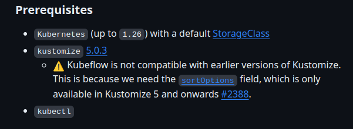
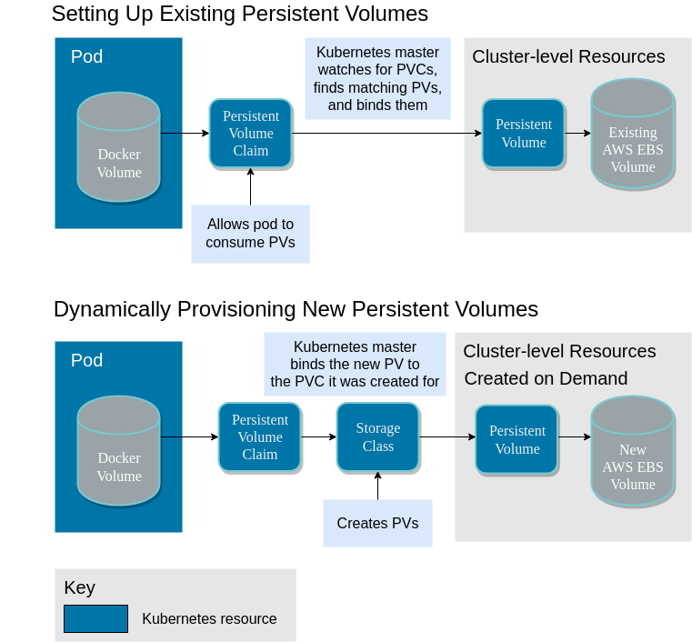
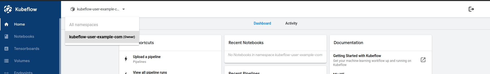
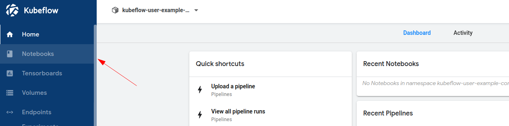
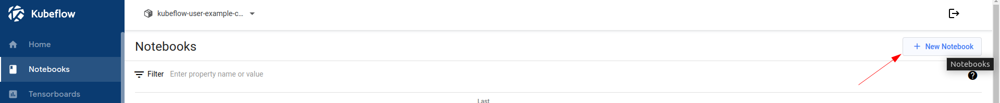
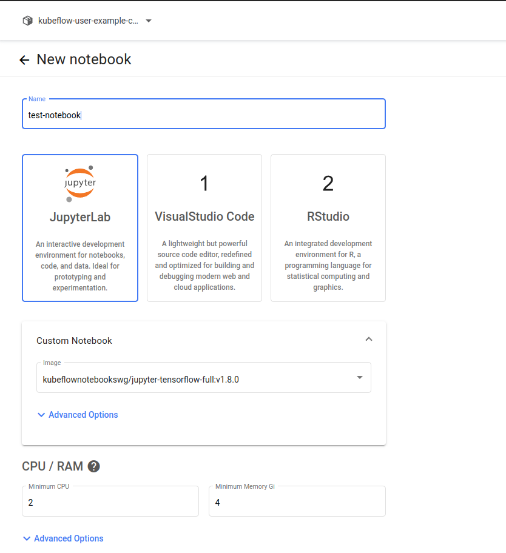
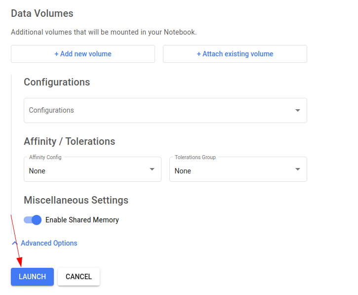
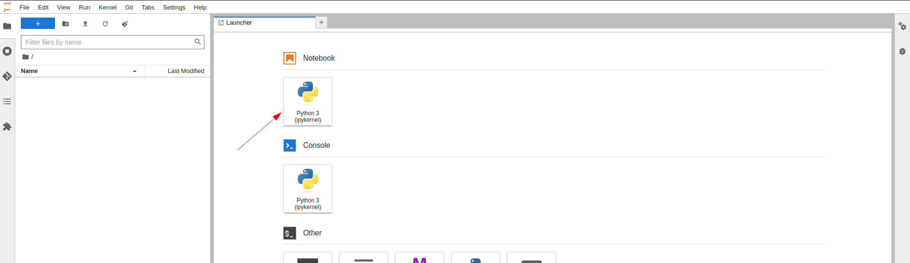
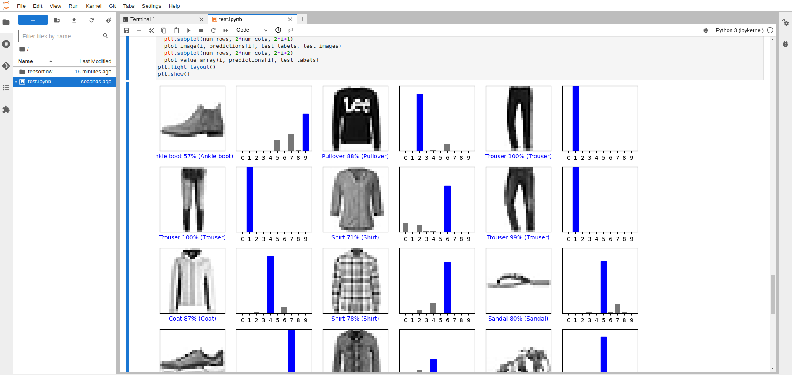

# Instalación de Kubeflow

Para instalar Kubeflow necesitamos:

- **Aprovisionamiento de infraestructura:** Creación de los nodos con Terraform o Vagrant.
- **Aprovisionamiento de Sofware:** Configuración de los nodos e instalación de Kubernetes (k8s)
- **Instalación manual de Kubeflow:** Usando los manifests que proporcionan en su repositorio.

## Aprovisionamiento de infraestructura con Terraform o Vagrant

Tanto como para Vagrant como para Terraform tendremos en cuenta un archivo de configuración principal, `k8s/ansible/group_vars/all.yml`. Dentro del archivo deberemos crear el perfil para nuestra prueba, donde modificaremos diferentes parámetros. En un principio, copiaremos debajo de las existentes y dentro de los usuarios un nuevo usuario con el nombre de nuestra preferencia, quedando con la siguiente forma:

```yml
---
settings:
env: '<nombre-de-nuestro-perfil>'
users:  
    <nombre-de-nuestro-perfil>:
        prod_test: false # Si es Vagrant, false, sino true, esto deshabilita o habilita los reinicios de las VPCs respectivamente para evitar errores.
        
        environment: "" # Variables de entorno que quisieramos agregar a Kubelet
        
        user_dir_path: /home/aagustin # Path al home del local-host
        node_home_dir: /home/vagrant # Path al home del remote-host

        shared_folders:
            - host_path: ./shared_folder # Para Vagrant, indicamos un path respecto a la Vagrantfile del local-host
            vm_path: /home/vagrant # Para Vagrant, indicamos un path donde querramos compartir con el local-host

        cluster_name: Kubernetes Cluster # Para Vagrant, indica el nombre del grupo de VPC's que se va a crear (es visualizable abriendo VirtualBox)
        
        ssh:
            user: "vagrant" # Usuario de SSH configurado en el remote-host
            password: "vagrant" # Clave de SSH configurada en el remote-host
            private_key_path: /home/aagustin/.ssh/vagrant_key # Path a la clave SSH privada guardada en el local-host
            public_key_path: /home/aagustin/.ssh/vagrant_key.pub # Path a la clave SSH pública guardada en el local-host

        nodes:
            control:
                cpu: 4 # Para Vagrant, cores asignados al master
                memory: 4096 # Para Vagrant, memoria asignada al master
            workers:
                count: 2 # Configurar cantidad de Workers
                cpu: 2 # Para Vagrant, cores asignados a los workers
                memory: 4096 # Para Vagrant, memoria asignada a los workers
        
        network:
            control_ip: 192.168.100.171 # Configuración de la IP del nodo master
            dns_servers:
                - 8.8.8.8 # DNS de Google, para acceso a Internet
                - 1.1.1.1 # DNS de Cloudflare, para acceso a Internet
            pod_cidr: 172.16.1.0/16 # No tocar, pool de IP para los pods
            service_cidr: 172.17.1.0/18 # No tocar, pool de IP para los servicios
        

        software:
            box: bento/ubuntu-22.04 # Para Vagrant, imagen a utlizar
            calico: 3.25.0 # Versión de Calico para configurar la red de los Pods
            kubernetes: 1.26.1-00 # Versión de Kubernetes para instalarlo y configurar CRI-O
            os: xUbuntu_22.04 # Versión del SO para configurar CRI-O
            kustomize: 5.0.3 # La versión de Kustomize que requiere Kubeflow 1.8
            kubeflow: 1.8 # La versión del repo de manifests que queremos descargar

```

> **¡IMPORTANTE!** : Recordar seleccionar en la variable `env` nuestro usuario.

### Vagrant

Habiendo creado nuestro perfil, deberemos tener en cuenta de modificar los siguientes parámetros para nuestra infraestructura:

1. Deshabilitar los reinicios debido a problemas con carpetas compartidas:

    ```yml
    prod_test: false # Si es Vagrant, false, sino true, esto deshabilita o habilita los reinicios de las VPCs respectivamente para evitar errores.
    ```

2. Configuración de SSH:

    ```yml
    ssh:
        user: "vagrant" # Usuario de SSH configurado en el remote-host
        password: "vagrant" # Clave de SSH configurada en el remote-host
        private_key_path: /home/aagustin/.ssh/vagrant_key # Path a la clave SSH privada guardada en el local-host
        public_key_path: /home/aagustin/.ssh/vagrant_key.pub # Path a la clave SSH pública guardada en el local-host
    ```

    > **¡Importante!** Debimos haber creado nuestra clave SSH previamente.

3. Configuración de la cantidad de recursos a asignar a los nodos y la cantidad de nodos:

    ```yml
    nodes:
        control:
            cpu: 4 # Para Vagrant, cores asignados al master
            memory: 4096 # Para Vagrant, memoria asignada al master
        workers:
            count: 2 # Configurar cantidad de Workers
            cpu: 2 # Para Vagrant, cores asignados a los workers
            memory: 4096 # Para Vagrant, memoria asignada a los workers
    ```

4. Configuración de red:

    ```yml
    network:
        control_ip: 192.168.100.171 # Configuración de la IP del nodo master
    ```

    > **¡Importante!** En el caso de Vagrant, no es necesario que sea una IP de la red de nuestra LAN, debido a que se creará una nueva red privada para los nodos.

5. Configuración del sistema:

    ```yml
    software:
        box: bento/ubuntu-22.04 # Para Vagrant, imagen a utlizar
    ```

Finalmente, podemos levantar nuestros nodos con la Vagrantfile:

```sh
# Posicionados en <repo-dir>/kubernetes/k8s/
vagrant up
```

En el caso de necesitar destruir las máquinas virtuales:

```sh
# Posicionados en <repo-dir>/kubernetes/k8s/
vagrant destroy
```

### Terraform

En nuestro caso nos encontramos aprovisionando infraestructura utilizando como base la plataforma de virtualización Proxmox, donde tendremos disponible ciertos recursos que destinaremos a la creación de los nodos (máquinas virtuales) mediante Terraform utilizando de provider justamente a Proxmox.

Además de modificar el archivo de `k8s/ansible/group_vars/all.yml`, deberemos modificar nuestros archivos de `<project-dir>/terraform/`.

Comenzaremos modificando los valores de los archivos de `<project-dir>/terraform/`:

1. Modificamos el archivo `<project-dir>/terraform/main.tf`:

    ```ruby
    terraform {
    required_providers {
        proxmox = {
        source  = "telmate/proxmox" # Seleccionamos el provider de proxmox
        version = "2.9.11"
        }
    }
    }

    provider "proxmox" {

    pm_debug = true
    pm_api_url = "https://192.168.100.100:8006/api2/json" # 
    pm_api_token_id = "terraformuser@pam!terraformuser_token" # Usuario Proxmox hardcodeado
    pm_api_token_secret = "..." # Token de proxmox hardcodeado
    pm_tls_insecure = true
    pm_log_levels = {
        _default    = "debug"
        _capturelog = ""
        }
    }


    resource "proxmox_vm_qemu" "vms-pps" {

    count       = length(var.proxmox_nodes)
    name        = "k8spps${count.index+1}" # Modificamos el nombre de nuestras vm's
    desc        = "k8s pps" # Modificamos la descripción de nuestras vm's
    vmid      = "70${count.index+1}" # Modificamos el ID de nuestras vm's
    target_node = var.proxmox_nodes[count.index] # Creará los nodos según la lista en el archivo 'vars.tf'
    clone       = var.template_name
    agent       = 1
    os_type     = "cloud-init"
    cores       = 8 # Modificamos la cantidad de núcleos de nuestras vm's
    sockets     = 1
    cpu         = "host"
    memory      = 8192  # Modificamos la cantidad de memoria de nuestras vm's
    onboot      = true
    scsihw      = "virtio-scsi-single"
    bootdisk    = "scsi0"

    disk {
        size     = "20G" # Modificamos la cantidad de almacenamiento de nuestras vm's
        type     = "scsi"
        storage  = "local-lvm"
        iothread = 1
    }

    network {
        model  = "virtio"
        bridge = "vmbr0"
    }
    
    lifecycle {
        ignore_changes = [
        network,
        ]
    }

    ipconfig0   = "ip=192.168.100.17${count.index+1}/24,gw=192.168.100.1" # Modificamos las IP's de nuestras vm's
    nameserver  = "192.168.100.1" # Modificamos el GW de nuestras vm's

    }
    ```

2. Modificamos el archivo `<project-dir>/terraform/vars.tf`:

    ```ruby
    variable "ssh_key" {
    default = "ssh-rsa ..." # Copiamos nuestra clave privada SSH
    }

    variable "proxmox_nodes" {
    type    = list(string)
    default = ["controlador", "nodo1", "nodo2"] # Le damos un nombre a cada nodo y definimos la cantidad añadiendo o quitando elementos a esta lista
    }

    variable "template_name" {
        default = "ubuntu-2204-template-labredes-pass-key-sudoer-nopasswd" # Elegimos la template a utilizar
    }
    ```

3. El archivo `<project-dir>/terraform/create_template.sh` nos permite hacer modificaciones en las mismas máquinas virtuales durante su creación, es un conjunto de comandos que nos permitirá, por ejemplo, darle permisos de super-usuario al usuario o inyectarle las claves públicas SSH a los known-host. **Modificaremos este archivo en caso de que cambiemos de cluster o movamos de lugar las claves SSH, las nombremos de manera distinta o necesitemos cambiar el nombre de la carpeta del usuario.** Las líneas que deberemos modificar en este caso son las siguientes:

    ```sh
    sudo virt-customize -a jammy-server-cloudimg-amd64.img --run-command 'useradd -m -s /bin/bash labredes' # Para añadir el usuario "labredes"
    sudo virt-customize -a jammy-server-cloudimg-amd64.img --run-command 'echo "labredes:labredes" | chpasswd' # Para añadirle la contraseña "labredes" al usuario "labredes"
    sudo virt-customize -a jammy-server-cloudimg-amd64.img --run-command 'usermod -aG sudo,adm labredes' # Para darle permisos de administrador y super-usuario al usuario "labredes"
    sudo virt-customize -a jammy-server-cloudimg-amd64.img --run-command 'mkdir -p /home/labredes/.ssh' # Para crear la carperta del usuario en home y la carpeta .ssh
    sudo virt-customize -a jammy-server-cloudimg-amd64.img --ssh-inject labredes:file:/root/.ssh/id_key_labredes.pub # Para inyectar la clave pública
    sudo virt-customize -a jammy-server-cloudimg-amd64.img --run-command 'chown -R labredes:labredes /home/labredes/.ssh' # Para cambiar la propiedad de la carpeta home al usuario "labredes"
    sudo virt-customize -a jammy-server-cloudimg-amd64.img --run-command 'echo "labredes ALL=(ALL) NOPASSWD: ALL" >> /etc/sudoers' # Para permitir al usuario "labredes" ejecutar comandos sudo sin escribir 'sudo <command>'
    ```

Finalmente, aplicamos los siguientes comandos de Terraform:

a. Para inicializar un directorio de trabajo de Terraform. Descargar y configurar los proveedores de infraestructura necesarios, así como cualquier módulo de Terraform que esté siendo utilizado. Es el primer comando que se debe ejecutar al trabajar con un nuevo proyecto de Terraform.

```sh
# Posicionados en <project-dir>/terraform/
terraform init
```

b. Para crear un plan de ejecución detallado de los cambios que se aplicarán a la infraestructura. Examinar los archivos de configuración de Terraform y determinar qué recursos se crearán, modificarán o eliminarán. El plan también muestra los valores de los atributos de los recursos y cualquier cambio propuesto.

```sh
# Posicionados en <project-dir>/terraform/
terraform plan
```

c. Para aplicar los cambios definidos en el archivo de configuración de Terraform y realizar las acciones necesarias para lograr el estado deseado de la infraestructura. Terraform leerá el plan generado por el comando terraform plan y solicitará confirmación antes de aplicar los cambios. Una vez confirmado, Terraform creará, modificará o eliminará los recursos según lo especificado.

```sh
# Posicionados en <project-dir>/terraform/
terraform apply
```

Ahora, modificando los valores de `k8s/ansible/group_vars/all.yml`:

1. Habilitar los reinicios de las VPCs:

    ```yml
    prod_test: true # Si es Vagrant, false, sino true, esto deshabilita o habilita los reinicios de las VPCs respectivamente para evitar errores.
    ```

2. Configuración de SSH:

    ```yml
    ssh:
        user: "labredes" # Usuario de SSH configurado en el remote-host
        password: "labredes" # Clave de SSH configurada en el remote-host
        private_key_path: /home/aagustin/.ssh/cluster_key # Path a la clave SSH privada guardada en el local-host
        public_key_path: /home/aagustin/.ssh/cluster_key.pub # Path a la clave SSH pública guardada en el local-host
    ```

    > **¡Importante!** Debimos haber creado nuestra clave SSH previamente.

3. Aquí solo deberemos modificar la cantidad de nodos (sin borrar nada de lo otro):

    ```yml
    nodes:
        workers:
            count: 2 # Configurar cantidad de Workers
    ```

4. Configuración de red:

    ```yml
    network:
        control_ip: 192.168.100.171 # Configuración de la IP del nodo master
    ```

## Aprovisionamiento de software con Ansible

Aquí simplemente modificamos, tanto como si utilizamos Vagrant o Terraform, los siguientes valores de `k8s/ansible/group_vars/all.yml`:

1. Seleccionamos las versiones de los diferentes elementos:

    ```yml
   software:
        calico: 3.25.0 # Versión de Calico para configurar la red de los Pods
        kubernetes: 1.26.1-00 # Versión de Kubernetes para instalarlo y configurar CRI-O
        os: xUbuntu_22.04 # Versión del SO para configurar CRI-O
        kustomize: 5.0.3 # La versión de Kustomize que requiere Kubeflow 1.8
        kubeflow: 1.8 # La versión del repo de manifests que queremos descargar
    ```

Además deberemos modificar el inventario en ambos casos, en nuestro caso, para ser pŕacticos separamos en dos inventarios correspondientes a las prubas locales (`ansible/inventory_local.yml`) y las pruebas de laboratorio (`ansible/inventory_lab.yml`). Modificaremos el que corresponda como sigue:

```yml
---

all:
  children:
    kube_master:
      hosts:
        master-node-171:
          ansible_host: "{{ CONTROL_IP }}"
    kube_workers:
      hosts:
        worker-node-172:
            ansible_host: "{{ IP_SECTIONS }}172"
        worker-node-173:
            ansible_host: "{{ IP_SECTIONS }}173"
        ...
        ...
        worker-node-17N:
            ansible_host: "{{ IP_SECTIONS }}17N"
```

> **¡Importante!** Como vemos, añadiremos tantos worker-node's como hayamos creado en la sección de infraestructura y deberemos asignar *manualmente* la IP de HOST correspondiente a cada uno.

Comprobamos conexión con los nodos con el módulo `ping`:

```sh
# Posicionados en <repo-dir>/kubernetes/k8s/
ansible -i ansible/inventory_<local o lab>.yml -m ping all
```

> Deberíamos ver PING con respuesta PONG de cada uno de los nodos que hayamos creado.

Finalmente, para correr hacer el aprovisionamiento de Software ejecutamos el siguiente comando:

```sh
# Posicionados en <repo-dir>/kubernetes/k8s/
ansible-playbook -vvv ansible/site.yml -i ansible/inventory_<local o lab>.yml
```

> **-vvv**: Indica el nivel de Verbose (logs) que veremos, podríamos no usar ese parámetro si no quisiéramos demasiados logs.

> **¡Importante!** Debemos además seleccionar el inventario según corresponda.

## Instalación manual de Kubeflow

Para la instalación de Kubeflow tenemos dos métodos: Paquetizado para diferentes plataformas o mediante los manifest (inistalación manual). En nuestro caso, al hacer una instalación local y limpia (bare-metal) de Kubernetes, **vamos a utilizar la segunda, mediante sus manifests**, los cuales se encuentran en su [repositorio](https://github.com/kubeflow/manifests).

Necesitaremos elegir la versión que nos convenga, en nuestro caso, utlizaremos la más reciente a la fecha que es la correspondiente a la branch `v1.8-branch` del correspondiente repositorio. Seleccionaremos dicha branch para observar los requerimientos.

Leeremos el README para poder seguir el instructivo de instalación, pero para también poder ver los pre-requisitos que nos solicita Kubeflow para su funcionamiento.

> **¡Importante!** Trabajaremos en el directorio `~/` del nodo master, ingresaremos mediante SSH al mismo:
>
> ```sh
> ssh -i ~/.ssh/key <user>@<IP-master>
> ```

Si observamos, a la fecha y para dicha versión nos pide:



El primer requisito, de la versión de Kubernetes, está cubierto debido a que hemos instalado la misma, nos falta definir una Default StorageClass.

> **¿Qué es una StorageClass?** Las clases de almacenamiento de Kubernetes proporcionan una forma de aprovisionar dinámicamente almacenamiento persistente para aplicaciones que se ejecutan en un clúster de Kubernetes. Cada StorageClass contiene los campos provisioner, parameters y reclaimPolicy, que se utilizan cuando un PersistentVolume que pertenece a la clase debe aprovisionarse dinámicamente.
>
> <a href="https://ranchermanager.docs.rancher.com/how-to-guides/new-user-guides/manage-clusters/create-kubernetes-persistent-storage/manage-persistent-storage/about-persistent-storage"></a>

El segundo requisito es tener Kustomize instalado, esto nos permitirá la aplicación de las configuraciones (`kubectl apply ...`) de Kubernetes de manera automatizada.

Y por último, nos pide tener Kubectl, el cual está cubierto ya que se ha instalado durante el aprovisionamiento de Software.

Habiendo hecho el aprovisionamiento con Ansible nos habremos asegurado de tener la Local StorageClass agregada y por defecto, de tener Kustomize instalado y de tener el repositorio correspondiente a los manifests de la versión deseada ya descargado, por lo que nos queda instalar manualmente Kubeflow en nuestro Cluster. Para ello tenemos dos caminos, la instalación en un solo comando o la intalación módulo a módulo. Elegiremos la segunda por una cuestión de asegurarnos la correcta instalación paso a paso de cada uno de los módulos.

1. Accedemos a la carpeta de los manifests:

    ```sh
    # Posicionados en ~/
    cd manifests
    ```

    > **¡Importante!** Se recomienda instalar comando a comando, tomando su tiempo en cada uno para checkear que se hayan levantado todos los pods, pudiendo visualizar todo esto desde el dashboard. Además, puede que algunos elementos de la instalación, como el Authservice no se inicien hasta que no hayamos levantado el siguiente, Dex en este caso. Por lo que se recomienda continuar si Eventos corresponden a errores de Webhooks. Ante la duda, podemos hacer la instalación de un solo comando que figura en el mismo repositorio.

2. Instalamos el cert-manager:

    ```sh
    kustomize build common/cert-manager/cert-manager/base | kubectl apply -f -
    kubectl wait --for=condition=ready pod -l 'app in (cert-manager,webhook)' --timeout=180s -n cert-manager
    kustomize build common/cert-manager/kubeflow-issuer/base | kubectl apply -f -
    ```

    Checkeamos que todos los pods estén creados y corriendo:

    ```sh
    watch kubectl get pods -n cert-manager
    ```

3. Instalamos Istio:

    ```sh
    kustomize build common/istio-1-17/istio-crds/base | kubectl apply -f -
    kustomize build common/istio-1-17/istio-namespace/base | kubectl apply -f -
    kustomize build common/istio-1-17/istio-install/base | kubectl apply -f -
    ```

    Checkeamos que todos los pods estén creados y corriendo:

    ```sh
    watch kubectl get pods -n istio-system
    ```

4. Instalamos el AuthService:

    ```sh
    kustomize build common/oidc-client/oidc-authservice/base | kubectl apply -f -
    ```

    Checkeamos que todos los pods estén creados y corriendo:

    ```sh
    watch kubectl get pods -n auth
    ```

5. Instalamos Dex:

    ```sh
    kustomize build common/dex/overlays/istio | kubectl apply -f -
    ```

6. Instalamos K-Native Serving

    ```sh
    kustomize build common/knative/knative-serving/overlays/gateways | kubectl apply -f -
    kustomize build common/istio-1-17/cluster-local-gateway/base | kubectl apply -f -
    ```

    Checkeamos que todos los pods estén creados y corriendo:

    ```sh
    watch kubectl get pods -n knative-eventing
    ```

    Y también:

    ```sh
    watch kubectl get pods -n knative-serving
    ```

7. Creamos el namespace de Kubeflow:

    ```sh
    kustomize build common/kubeflow-namespace/base | kubectl apply -f -
    ```

8. Instalamos los Kubeflow Roles:

    ```sh
    kustomize build common/kubeflow-roles/base | kubectl apply -f -
    ```

    Checkeamos que todos los pods estén creados y corriendo:

    ```sh
    watch kubectl get pods -n kubeflow
    ```

9. Creamos los recursos de Istio:

    ```sh
    kustomize build common/istio-1-17/kubeflow-istio-resources/base | kubectl apply -f -
    ```

    Checkeamos que todos los pods estén creados y corriendo:

    ```sh
    watch kubectl get pods -n istio-system
    ```

10. Creamos las Pipelines de Kubeflow

    ```sh
    kustomize build apps/pipeline/upstream/env/cert-manager/platform-agnostic-multi-user | kubectl apply -f -
    ```

    Checkeamos que todos los pods estén creados y corriendo:

    ```sh
    watch kubectl get pods -n kubeflow
    ```

11. Checkeamos la creación de los pods del ejemplo:

    ```sh
    watch kubectl get pods -n kubeflow-user-example-com
    ```

## Crear servicio para exponer el Dashboard de Kubeflow a la IP del nodo

### Exponer el servicio (port-forward) - No recomendado

```sh
kubectl port-forward svc/istio-ingressgateway -n istio-system 8080:80
```

### Exponer el servicio (NodePort) - Recomendado

1. Creamos el siguiente archivo para el servicio servicio `forwarding-svc.yaml`:

    ```yaml
    apiVersion: v1
    kind: Service
    metadata:
    name: custom-pf-svc
    namespace: istio-system
    spec:
    type: NodePort
    ports:
        - targetPort: 8080 # Where the other service is listening
        port: 80  # Where this service are available inside the cluster
        nodePort: 30002 # Where to expose this service
    selector:
        app: istio-ingressgateway  # Service to expose 
    ```

2. Aplicamos la configuración:

    ```sh
    kubectl apply -f forwarding-svc.yaml
    ```

3. Buscamos la IP (url) donde está expuesto:

    ```sh
    # Caso de que no funcione el comando, ingresamos a la IP del nodo y al puerto configurado.
    kubectl get service -n istio-system custom-pf-svc --url
    ```

4. Ingresamos a la url que nos muestra.

## Correr ejemplo

Una vez hayamos ingresado a Kubeflow con nuestra usuario y contraseña de ejemplo: `user@example.com` y `12341234`.

> **¡Importante!** Como vamos a trabajar sobre HTTP y no sobre HTTPS deberemos modificar la variable de entorno de `APP_SECURE_COOKIES` y setearla en `false` en cada web app que necesitemos, en nuestro caso será para Notebooks. De todas maneras no es recomendado por riesgos de seguridad. Para nuestro ejemplo:
>
> ```sh
> kubectl edit deploy jupyter-web-app-deployment -n kubeflow
> ```
>
> Y este también:
>
> ```sh
> kubectl edit deploy volumes-web-app-deployment -n kubeflow
> ```

1. Seleccionamos nuestro namespace (en nuestro caso el ejemplo que viene desplegado con la instalación)

    

2. Ingresar a Kubeflow en su sección "Notebooks"

    

3. Crear un Nuevo Notebook Server haciendo clicl en "+ New Notebook"

    

4. Elegimos un nombre para el Notebook Server, un entorno, el tipo de imágen, la cantidad de CPU's y RAM del mismo:

    

5. En nuestro caso no utilizamos GPU y crearemos un nuevo volumen para el mismo:

    

6. Hacemos click en "Lauch":

    

7. Esperamos que esté Ready y hacemos Click en "Connect"

    

8. Copiamos el siguiente código en el notebook:

    [Basic classification: Classify images of clothing](https://www.tensorflow.org/tutorials/keras/classification)

    

    

> **¡Importante!** Con *Ctrl + S* podemos guardar el notebook creado, a partir de acá nos manejamos como si tuvieramos Notebook en local. Tambien recordar instalar dependencias abriendo una consola desde le mismo Notebook Server (boton + arriba a la izquierda)

## Extra: Instalación local con Minikube

Si deseamos correr en local con Minikube, podemos seguir los sigueintes pasos:

### Instalación del binario

```sh
curl -LO https://storage.googleapis.com/minikube/releases/latest/minikube-linux-amd64
sudo install minikube-linux-amd64 /usr/local/bin/minikube
```

### Configuración de alias para kubectl

```sh
alias kubectl="minikube kubectl --"
```

### Despliegue de 1 nodo

```sh
minikube start --kubernetes-version='1.26.1' --memory='12288' --cpus='8' --disk-size='80GB' --vm=true
minikube addons enable metrics-server
```

> **¡Importante!** La cantidad de CPUs es como mínimo de 8, sino no se levantarán todos los servicios. La RAM es como mínimo de 12HB y el almacenamiento debe ser de como mínimo de 60GB.

### Detener la ejecución del Cluster

```sh
minikube stop --all
```

### Visualización

Desde otra terminal o antes de empezar podemos correr el Dashboard con el siguiente comando:

```sh
minikube dashboard
```

### Instalación de Kustomize

1. Descarga de instalador

    ```sh
    wget https://raw.githubusercontent.com/kubernetes-sigs/kustomize/master/hack/install_kustomize.sh
    ```

2. Instalación de versión 5.0.3

    ```sh
    chmod +x install_kustomize.sh
    ./install_kustomize.sh 5.0.3
    chmod +x kustomize
    mv kustomize /usr/local/bin
    ```

### Descarga de los manifiestos

```sh
git clone https://github.com/kubeflow/manifests.git -b v1.8-branch
cd manifests/
```

### Instalación de un solo comando (aprox 40min)

```sh
while ! kustomize build example | kubectl apply -f -; do echo "Retrying to apply resources"; sleep 10; done
```

### Exposición de servicio dentro del cluster (port-forward)

```sh
kubectl port-forward svc/istio-ingressgateway -n istio-system 8080:80
```

### Exponer fuera del cluster (NodePort)

1. Creamos el siguiente archivo para el servicio servicio `forwarding-svc.yaml`:

    ```yaml
    apiVersion: v1
    kind: Service
    metadata:
    name: custom-pf-svc
    namespace: istio-system
    spec:
    type: NodePort
    ports:
        - targetPort: 8080 # Where the other service is listening
        port: 80  # Where this service are available inside the cluster
        nodePort: 30001 # Where to expose this service
    selector:
        app: istio-ingressgateway  # Service to expose 
    ```

2. Aplicamos la configuración:

    ```sh
    kubectl apply -f forwarding-svc.yaml
    ```

3. Buscamos la IP (url) donde está expuesto:

    ```sh
    minikube service -n istio-system custom-pf-svc --url
    ```

4. Ingresamos a la url que nos muestra.

## Referencias

- [Creación de Local StorageClass y Local PersistentVolume](https://www.civo.com/academy/kubernetes-volumes/local-volume-demo)

- [Fix Bug HTTP for Notebook creation - "Could not find CSRF cookie XSRF-TOKEN"](https://medium.com/@ratchaphon/fix-bug-kubeflow-403-could-not-find-csrf-cookie-xsrf-token-in-the-request-1f4ac886050c)

- [Tensorflow - Basic classification: Classify images of clothing](https://www.tensorflow.org/tutorials/keras/classification)

- [Levantar Kubeflow con Minikube](https://dagshub.com/blog/how-to-install-kubeflow-locally/)
